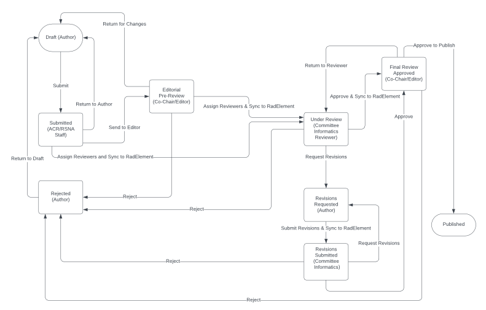

The RSNA and ACR review all submitted common data elements. The review process mimics peer-reviewed journal submissions.

The first step of review ensures complete submissions, this is performed by ACR/RSNA staff.

Each set is reviewed by a single reviewer, tasked with evaluting adherance to the [Set](../reference/set), [Element](../reference/element), and [Value](../reference/valueset) standards. Reviewers are asked to limit their input on clinical relevance or applicability to egregious clinical errors, or CDEs where the reviewer believes the author's intent is corrupted. 

Iterations between reviewers and authors are encouraged until the CDE set is ready for editorial approval. Each set is reviewed by an editor who may ask for additional revisions or approve for publishing. As shown below proposed CDE sets are stored to RadElement at several steps along the review process.

A detailed workflow diagram is below.

