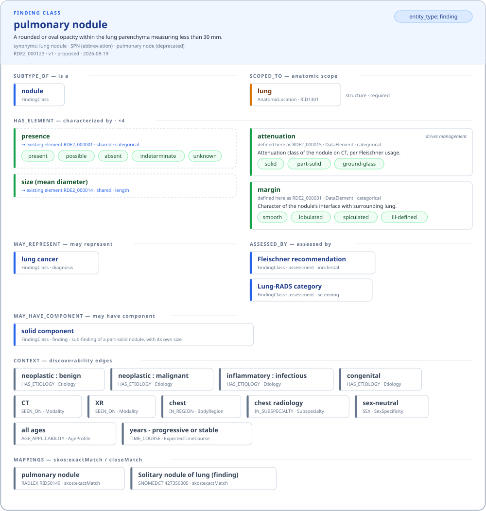
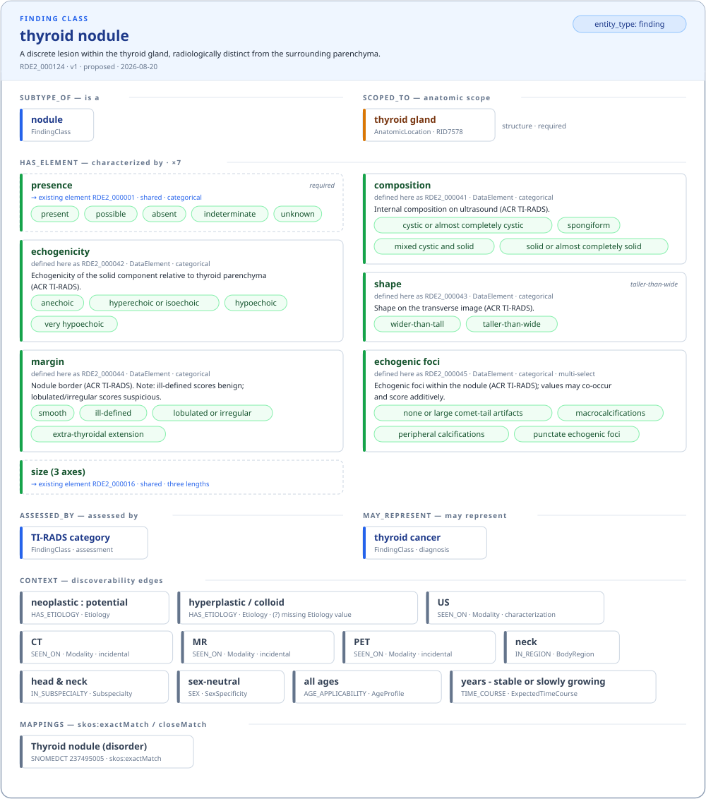
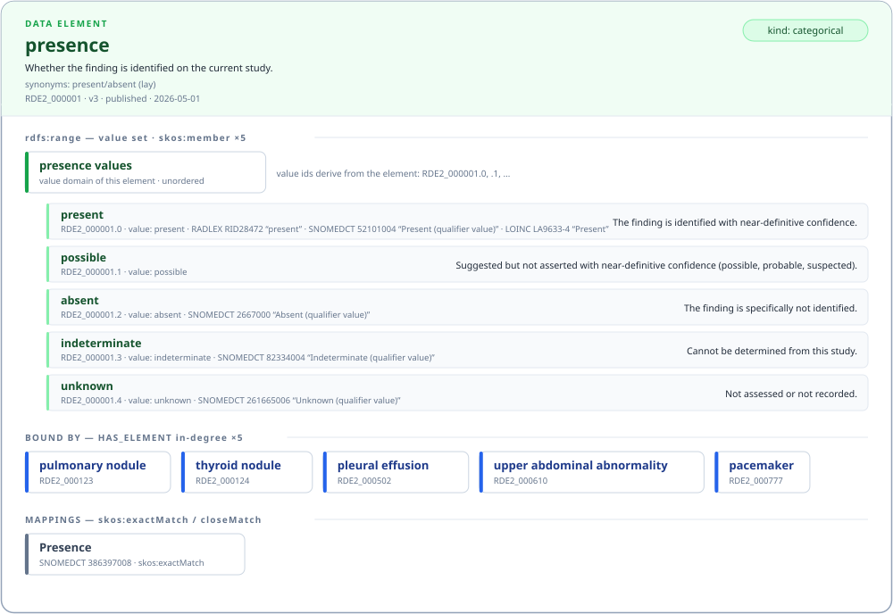
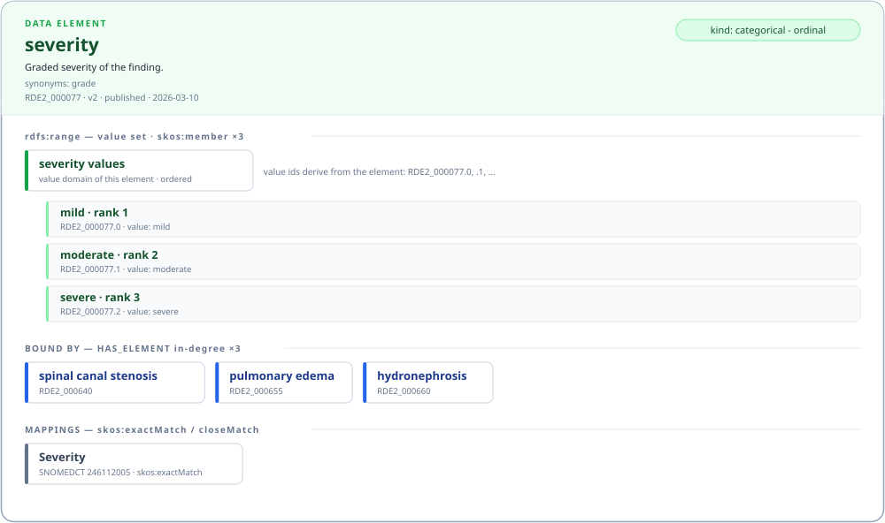
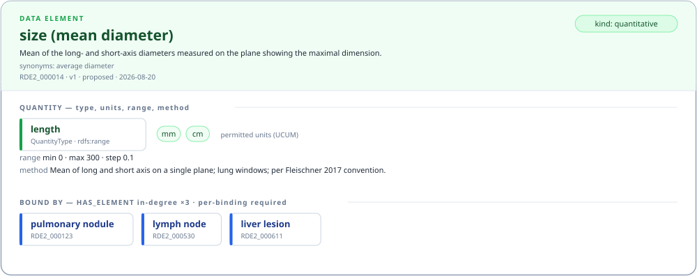
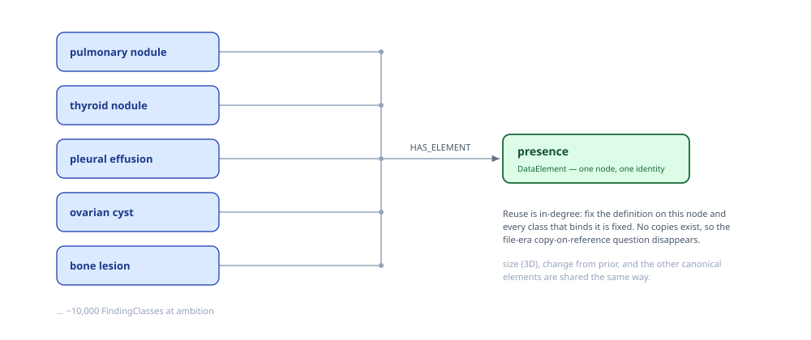
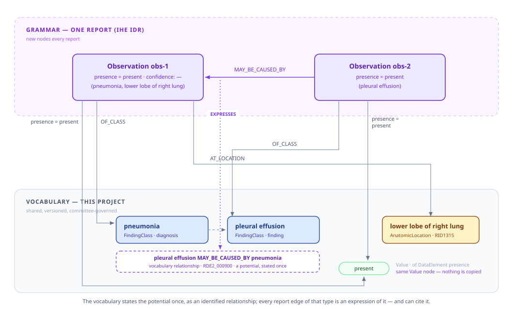
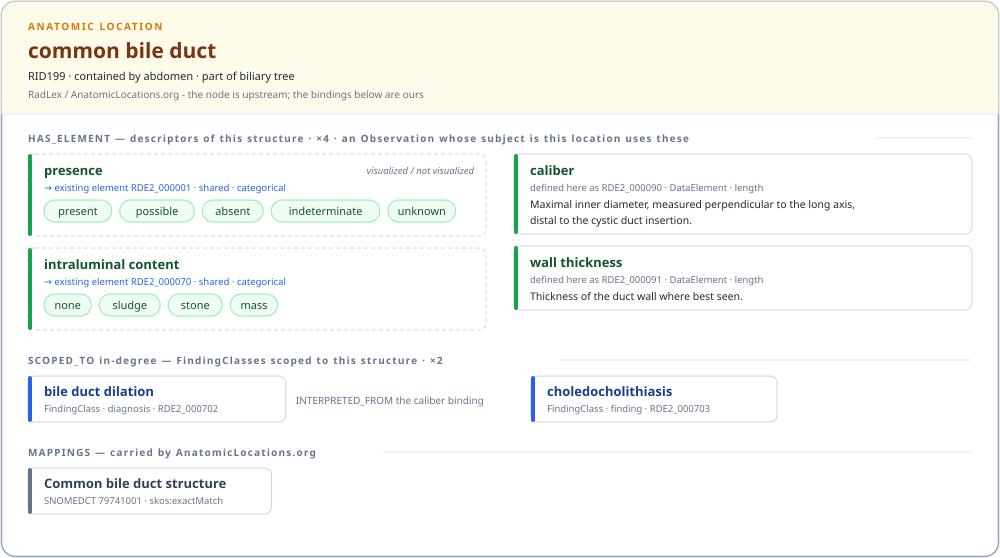

# Draft Structures for Worked Examples

**Status:** Strawman — a shape concrete enough to write examples against, so modelling arguments happen over real cases instead of in the abstract.

**The model is a graph** ([00 §2.2](./00-current-understanding.md)): nodes carry only scalars; everything shared is a node, and everything that points at something shared is an edge. The flat text forms in §6 are *serializations of the graph*, not the model. Open choices are marked **⟨?⟩**.

---

## 1. Nodes

| Node type | Carries (scalars only) | Owned by |
|---|---|---|
| **FindingClass** | id, name, definition, typed synonyms, `entity_type`, version, status | us — ids from the shared `RDE2_NNNNNN` namespace ([00 Issue E](./00-current-understanding.md)); samples here still show the older `FC-`/`DE-` placeholders |
| **Diagnosis** | as FindingClass, without `entity_type` | us — separate node type agreed 2026-08-25 ([exchange §1](../../notes/review-exchange-2026-08-25-extract.md)). With the taxonomy unrestricted (10 S1) and no obligations on node types (10 S4), what still distinguishes Diagnosis from FindingClass is only which relationship types it can source, `MAY_MANIFEST_AS` above all ([07](./07-relationship-family.md)); a Claude observation, not a decision. Shares one taxonomy with FindingClass ([10 S1](./10-decision-record-2026-09-02.md)) |
| **Grouping** | id, name, definition | us — the negative-only nodes (`renal abnormality`) that sit above findings and diagnoses alike; added 2026-09-02 ([10 S8](./10-decision-record-2026-09-02.md)) |
| **DataElement** | id, name, definition, typed synonyms, kind (categorical/quantitative), cardinality, ordinality, quantity type + permitted units + method, version, status | us |
| **Value domain** | whether ordered | the element's own enumerated domain (ISO 11179 *value domain*; `owl:oneOf` of its Values) — owned by the element, not separately identified |
| **Value** | id = `{element id}.{n}`, name, machine value = slug of the name, definition | us — first-class: an ISO 11179 *permissible value*; own index codes (LOINC LA codes fit here). Ids derive from the element (`RDE2_000001.0`, `.1`, …), so a value belongs to exactly one element; scale reuse is element reuse |
| **RelationshipType** | name, inverse or symmetric, whether transitive | us |
| **AnatomicLocation** | RID, name, laterality triad | RadLex via AnatomicLocations.org — and the binding subject for a normal structure's descriptor elements (§9) |
| **Concept nodes** | Etiology, BodyRegion, Subspecialty, Modality, AgeStage, TimeCourse — the OIFM metadata vocabularies, each value one shared node | us, seeded from OIFM |
| **Observation** | a claim in one report | **the grammar (IHE IDR)** — drawn here only to show consumption |

Identity metadata every owned node also carries: index codes, contributors, references, exemplar images with rights (all from the current schema). Status *history* lives in the separate event log, not on nodes ([00 §4](./00-current-understanding.md), topic 6).

## 2. Edges — the actual content of the model

| Edge | From → To | Properties on the edge | Why |
|---|---|---|---|
| `HAS_ELEMENT` | FindingClass **or AnatomicLocation** → DataElement | own id, contextual note (a `required` flag was carried here until 2026-09-02 and removed: there is no such thing as a required element, [08 §2](./08-worked-examples.md)) | the decoupling decision; this is the binding edge [00 §6](./00-current-understanding.md) says needs a name. Bound to a location it describes a normal structure (§9) and inherits down the anatomy |
| `rdfs:range` | DataElement → its value domain | — | the domain is an `owl:oneOf` enumeration of the element's Values (FHIR: a *binding*; 11179: an enumerated value domain) |
| `skos:member` | value domain → Value | rank (if ordered) | 11179: permissible values; `skos:OrderedCollection` carries ordinality |
| `SCOPED_TO` | FindingClass → AnatomicLocation | `kind` (structure/region/type), `strength` | anatomic scope guidance [01 §2](./01-what-the-vocabulary-must-express.md) |
| `rdfs:subClassOf` | FindingClass → FindingClass | — (transitive ⟨?⟩) | the is-a of [00 Issue A](./00-current-understanding.md); written `SUBTYPE_OF` informally |
| `MAY_HAVE_COMPONENT` · `MAY_CAUSE` · `MAY_REPRESENT` · `INTERPRETED_FROM` · `ASSESSED_BY` · `OCCURS_WITH` · `ADJACENT_TO` · `MAY_BE_RELATED_TO` | FindingClass ↔ FindingClass | **own id** (`RDE2_…`), provenance, approval status, strength ⟨?⟩ | typed relationships, [00 §4](./00-current-understanding.md) topic 5; identified so a report-level relationship can cite the potential it expresses (§5) |
| `HAS_ETIOLOGY` · `IN_REGION` · `IN_SUBSPECIALTY` · `SEEN_ON` · `AGE_*` · `TIME_COURSE` | FindingClass → concept node | — | discoverability: "every malignant finding" is a traversal |

Edge properties are why the formalism question ([00 Issue D](./00-current-understanding.md)) lands on named graphs / annotated axioms: `required` lives on `HAS_ELEMENT`, not on either node.

**Since 2026-09-02** ([08](./08-worked-examples.md)): `INTERPRETED_FROM` runs from any FindingClass or Diagnosis that interprets a measurement, not only from assessments; `HAS_ELEMENT` edges that must be cited carry `RDE2_` ids (the binding-identity question of [06 §4](./06-next-steps.md), resolved); the causal pair carries `typicality` and a proposed `expected` property of value hints; and the canonical form of §6.2 exists as [`graph/`](graph/README.md), read by the validator, the constellation renderer, and the site builder.

### 2.1 Plain values versus formal relationships

The test, applied uniformly: **if the target has its own identity and governance — someone approves changes to it, more than one node points at it, it carries its own codes — it is a node behind a formal relationship. If it is intrinsic data about one node, it is a plain value.** Equivalently: needs its own approval → node; changes with the node → literal.

| Plain values (literal properties) | Formal relationships (edges to nodes) |
|---|---|
| name (`skos:prefLabel`), definition (`skos:definition`) | is-a (`rdfs:subClassOf`); element bindings (`HAS_ELEMENT`) |
| machine value string — the slugified name (11179 *representation*), numeric bounds | element → its value domain (`rdfs:range`); domain → Value (`skos:member`) |
| `entity_type` — closed schema enum, values carry no metadata of their own | anatomic scope; etiology, region, subspecialty, modality, sex, age, time course |
| units — UCUM literal codes | quantity type — a governed shared node that implies the units |
| version, status (history in the event log) | index codes as `skos:exactMatch`/`closeMatch` — mapping to an external concept is a relationship, not a string pair |
| `required`, binding strength, rank, scope kind/strength — properties **on edges** | contributors (`dcterms:contributor`), references, exemplar images |

Two entries sit on the line and are expected to migrate: **typed synonyms** (a label carrying its own type is what SKOS-XL models as a label node) and **measurement method** (a literal until two elements share one, at which point it has become a reusable governed thing and gets promoted — the same force that turned laterality from a DataElement into structure on the AnatomicLocation node).

**Every external code carries its source term, and no code is ever invented.** Codes are looked up (the mechanics are in [`tools/README.md`](tools/README.md)); an `exactMatch` is an exact-label hit, a `closeMatch` is a deliberately broader or narrower concept taken because the graph needs a mapping now, and a node with neither stays unmapped and says so in its note. When RadLex lacks a concept radiologists use, the node records it as a candidate for upstream proposal, the same treatment [04](./04-anatomy-gaps.md) gives anatomy. An anatomic location's only identifier is its RID; a RadLex code is never written beside it, because the RID is the RadLex code (10 S12). A mapping or index code is written as system + code + the term *as that ontology states it* (`SNOMEDCT 427359005 “Solitary nodule of lung (finding)”`, `RADLEX RID28472 “present”`), so a reader can see the right concept was bound without a lookup — the current schema's `display` field, made mandatory. Verifying this for the examples here already caught one error: RID28472 is RadLex's *value* "present", not an element "presence", and it has been moved accordingly.

**Relation names come from existing standards wherever one exists.** This is ontology: is-a is `rdfs:subClassOf`, synonyms are `skos:altLabel`, definitions `skos:definition`, the element-to-value-set relation is `rdfs:range` over an `owl:oneOf` enumeration (what FHIR calls a binding, what ISO 11179 calls an enumerated value domain of permissible values, what LOINC ships as answer lists). Invented names are reserved for genuinely domain-specific edges — `SCOPED_TO`, `MAY_REPRESENT`, `ASSESSED_BY` — and even those should be checked against RadLex's relation set before minting (§[00 §2.4](./00-current-understanding.md)).

---

## 3. The object view: a FindingClass is its gathered edges



A FindingClass is best read as **one object gathering its edges**. Each section of the card is one relationship type doing the gathering — `SUBTYPE_OF`, `SCOPED_TO`, `HAS_ELEMENT`, `MAY_REPRESENT`, `ASSESSED_BY`, and the context edges — and each entry inside a section is a **typed reference to a shared node** (color = node type: blue FindingClass, green DataElement, amber AnatomicLocation, slate concept). The networked-ness is in the references, not in drawn spaghetti: `presence` here is the same node every other class binds (§4), and `lung` is a pointer into the anatomy graph.

**Elements are either referenced or defined in place.** A class binds an **existing** element by id (`→ existing element RDE2_000001 · shared`, drawn with a dashed border), or it **defines a new element inline** with its full richness — id, definition, every value with its derived id, slug, definition, and codes, or quantity type, units, and method. The thyroid example does both: `presence` and `size (3 axes)` are references; the five TI-RADS descriptors are defined here. In the canonical form the distinction disappears — every element is a node and every binding an edge — so "inline" is an *authoring* convenience for the review form, and an agent applying edits turns an inline definition into a new element node plus a binding.

**This view is generated, not drawn.** [`tools/render_neighborhood.py`](tools/render_neighborhood.py) takes a small JSON graph view ([`examples/pulmonary-nodule.neighborhood.json`](examples/pulmonary-nodule.neighborhood.json)) and emits the card — so every FindingClass gets the same visualization for free, and eventually straight from a graph query. Same template, different spec — and the specs are interim: they now carry essentially the full class content, so once the canonical form (§6.2) exists, the renderer reads that and the parallel spec format disappears. Same template, different spec:



### 3.1 Drilling into a shared element

The same object-dossier treatment for a DataElement, with the sections an element actually has: its value domain (`rdfs:range` → `skos:member` values, each with derived id, slug value, definition, codes with source terms), **who binds it** with the per-binding `required`, and its mappings.

`presence` — the canonical shared element, five values (including `possible` for hedged positives) and five binders:



`severity` — an **ordered** value domain with ranks; the scale is reused by binding this one element from many classes:



`size (mean diameter)` — quantitative: quantity type, UCUM units, range, and the method that makes the measurement what it is ([01 §4.3](./01-what-the-vocabulary-must-express.md)):



Specs: [`examples/presence.element.json`](examples/presence.element.json), [`severity.element.json`](examples/severity.element.json), [`size-mean-diameter.element.json`](examples/size-mean-diameter.element.json); the same generator renders both node types. The FindingClass header now also carries the non-edge properties — id, version, status, typed synonyms — and a `MAPPINGS` section for its `skos:exactMatch` codes.

## 4. Reuse is in-degree



`presence` is one node with one identity. Fix its definition and every class that binds it is fixed; the file-era copy-on-reference question does not exist here ([00 §2.7](./00-current-understanding.md)).

## 5. Two planes: reports point into the vocabulary



Observations (grammar, new nodes every report) are small stars of pointers into the vocabulary (shared, versioned, committee-governed). Each Observation records what it is (`subject`, pointing to a FindingClass, Diagnosis, or Grouping), where it is (`location`, pointing to an AnatomicLocation), a compact map of data-element pointers to values (`values`), the exact report text it came from (`quote` and its `[start, end)` `span`), and pointers to relevant other Observations through relation lines. A report begins with a `report` line carrying its id and full text.

The two planes carry different relationships between different objects. In definition space the committee states a standing potential once, such as `acute pyelonephritis MAY_MANIFEST_AS striated nephrogram`. In observation space the radiologist's “consistent with” puts these particular findings together as this particular diagnosis. The provisional report relationship name for that act is `SUPPORTS`; `ASSOCIATED_WITH` provisionally connects a related Observation without negating the edge itself. The report edge does not cite the vocabulary relationship. The structures correspond, and the reader is expected to see that correspondence.

```jsonl
{"report":"rep-1","text":"Left kidney demonstrated striated nephrogram … consistent with pyelonephritis."}
{"observation":"obs-1","subject":"RDE2_000802","location":"RID29663","values":{"RDE2_000001":"present"},"quote":"striated nephrogram","span":[25,44]}
{"observation":"obs-4","subject":"RDE2_000800","location":"RID29663","values":{"RDE2_000001":"present"},"confidence":"consistent with","quote":"consistent with pyelonephritis","span":[94,124]}
{"relation":"SUPPORTS","from":"obs-1","to":"obs-4","quote":"consistent with"}
```

The same mechanism carries **sub-findings**. The vocabulary says a pulmonary nodule `MAY_HAVE_COMPONENT` a solid component, a potential stated once. A report of a part-solid nodule then contains *two* Observations, the nodule and its solid component (each with its own size, since Lung-RADS keys on the solid component's), joined by a report-level `HAS_COMPONENT` edge:

```jsonl
{"edge":"MAY_HAVE_COMPONENT","id":"RDE2_000901","from":"RDE2_000123","to":"RDE2_000130"}
{"observation":"obs-3","subject":"RDE2_000123","values":{"RDE2_000015":"part-solid","RDE2_000014":{"value":14,"unit":"mm"}}}
{"observation":"obs-4","subject":"RDE2_000130","values":{"RDE2_000014":{"value":6,"unit":"mm"}}}
{"relation":"HAS_COMPONENT","from":"obs-3","to":"obs-4"}
```

On the IHE side ([`notes/ihe-idr-extract.md` §4](../../notes/ihe-idr-extract.md)), IDR's Hierarchical Target Entity is exactly this case. Its worked example is a pulmonary nodule with solid and non-solid components, encoded with `.hasMember`, which is *untyped*; causation has **no FHIR mechanism yet**. The typed component and causal report edges are both things to raise with IHE as extensions, not things to assume.

This separation leaves vocabulary relationships free to carry identity, provenance, approval status, and strength ([§2](#2-edges--the-actual-content-of-the-model)) without making a report-level assertion an instance of one of them.

---

## 6. Two flat serializations

The graph needs two text forms, doing different jobs:

### 6.1 Review form — for humans (and the agents applying their edits)

Structured Markdown, one file per FindingClass, generated from the graph. Committee members read and redline it; an LLM agent turns accepted redlines into graph mutations. It is lossy-friendly: prose order and formatting carry no meaning.

```markdown
# pulmonary nodule — FindingClass FC-000123 · finding · v1 (proposed)

**Definition.** A rounded or oval opacity within the lung parenchyma measuring
less than 30 mm (larger is a mass; below ~6 mm, a micronodule).
**Synonyms.** lung nodule · SPN *(abbreviation)* · pulmonary node *(deprecated)*

**Anatomic scope.** lung (RID1301) — structure, **required**

## Elements
| element | binding | required | notes |
|---|---|---|---|
| presence | → existing RDE2_000001 | yes | |
| attenuation | **defined here** RDE2_000015 | | drives Fleischner and Lung-RADS |
| size (mean diameter) | → existing RDE2_000014 | | Fleischner convention: mean of long and short axis |
| margin | **defined here** RDE2_000031 | | spiculated margin is the discriminating value here |

### attenuation — new element RDE2_000015 · categorical
Attenuation class of the nodule on CT, per Fleischner usage.
| value | id | definition |
|---|---|---|
| solid | .0 | Homogeneous soft-tissue attenuation that obscures the underlying lung parenchyma. |
| part-solid | .1 | Both ground-glass and solid components. |
| ground-glass | .2 | Hazy increased attenuation that does not obscure vessels or bronchial walls. |

### margin — new element RDE2_000031 · categorical
Character of the nodule's interface with surrounding lung.
| value | id | definition |
|---|---|---|
| smooth | .0 | Well-defined, regular interface. |
| lobulated | .1 | Undulating contour from uneven growth. |
| spiculated | .2 | Linear strands radiating into the parenchyma; suspicious. |
| ill-defined | .3 | Margins cannot be clearly traced. |

## Relationships
- subtype of **nodule**
- may represent **lung cancer**
- assessed by **Fleischner recommendation** (incidental) and **Lung-RADS category** (screening)
- occurs with **pleural effusion**

## Clinical context
Body region: chest · Subspecialty: CH · Modalities: CT, XR
Etiologies: neoplastic (benign, malignant), inflammatory (infectious), congenital
Sex: neutral · Ages: all · Course: years; progressive or stable

## Codes & evidence
RADLEX RID50149 “pulmonary nodule” · SNOMEDCT 427359005 “Solitary nodule of lung (finding)”
MacMahon H, et al. Radiology 2017;284(1). doi:10.1148/radiol.2017161659
[Radiopaedia — pulmonary nodule](https://radiopaedia.org/articles/pulmonary-nodule-1) ·
[Radiology Assistant — Fleischner 2017](https://radiologyassistant.nl/chest/plumonary-nodules/fleischner-2017-guideline) ·
[Wikipedia — lung nodule](https://en.wikipedia.org/wiki/Lung_nodule)
```

### 6.2 Canonical form — for machines and diffs

Deterministic, line-oriented, round-trips to the graph with no interpretation: one JSON object per line; nodes before edges; nodes sorted by id, edges by (type, from, to); keys sorted; no derived or presentational data. This is what lives in git and what PRs diff ([00 §7.3](./00-current-understanding.md)).

```jsonl
{"id":"DE-000001","kind":"categorical","name":"presence","node":"DataElement"}
{"id":"FC-000123","entity_type":"finding","name":"pulmonary nodule","node":"FindingClass","definition":"A rounded ..."}
{"id":"DE-000001.0","name":"present","node":"Value","value":"present"}
{"id":"DE-000001.1","name":"possible","node":"Value","value":"possible"}
{"edge":"HAS_ELEMENT","from":"FC-000123","props":{"required":true},"to":"DE-000001"}
{"edge":"member","from":"DE-000001","to":"DE-000001.0"}
{"edge":"member","from":"DE-000001","to":"DE-000001.1"}
{"edge":"exactMatch","from":"DE-000001.0","props":{"display":"Present (qualifier value)"},"to":"SNOMEDCT:52101004"}
{"edge":"exactMatch","from":"FC-000123","props":{"display":"Solitary nodule of lung (finding)"},"to":"SNOMEDCT:427359005"}
{"edge":"SCOPED_TO","from":"FC-000123","props":{"kind":"structure","strength":"required"},"to":"RID1301"}
{"edge":"SEEN_ON","from":"FC-000123","to":"MOD-CT"}
{"edge":"SEEN_ON","from":"FC-000123","to":"MOD-XR"}
{"edge":"subClassOf","from":"FC-000123","to":"FC-000100"}
```

An element defined inline in the review form lands here as ordinary lines — a DataElement node, its Value nodes, `member` edges, and the `HAS_ELEMENT` binding — indistinguishable from an element that was shared all along. Round-trip contract: `graph → canonical → graph` is the identity; `canonical → graph → canonical` is byte-identical. The review form is *generated from* canonical and never round-trips. ⟨?⟩ Whether the canonical line format is this JSONL, Turtle, or OWL functional syntax follows from Issue D mechanics — the sorting/determinism rules are the substance, the syntax is a choice.

---

## 7. Canonical DataElements

The committee's draft reusable-element list ([committee notes](../../notes/committee-notes-extract.md)) as shared nodes — OIFM seeds `presence` and `change from prior`; this is the superset the committee sketched:

| Canonical element | Kind | Notes |
|---|---|---|
| presence | categorical | present / possible / absent / indeterminate / unknown — `possible` covers every hedged positive |
| change from prior | categorical | new / increased / stable / decreased / resolved |
| size (1D long axis) · (1D short axis) | quantitative | `quantity_type: length` |
| size (3D) | quantitative, 3 components | decided: quantity type with components, not a grouping ([00 §8 Decided](./00-current-understanding.md)) |
| size (volume) · size (qualitative) | quantitative · ordinal | |
| attenuation (CT) · signal intensity (MR) · echogenicity (US) · density (XR) · uptake (NM) | per-modality family | the committee's "color" examples |

*Laterality is deliberately absent* — carried by the AnatomicLocation node. Location in general is likewise not a canonical element: it is the Observation's AnatomicLocation pointer ([00 §1.3](./00-current-understanding.md)). There may be data elements that express *more precise* location than the anatomic location codes permit — position within a structure, relation to a landmark — but those are ordinary elements defined where needed, not canonical ones. The committee's canonical **grading scales** (mild/moderate/severe and kin) are shared **elements** — one `severity` bound by every class that grades — since values belong to exactly one element.

**Surfaced by source review** (Radiopaedia, Radiology Assistant, Wikipedia, 2026-08-20; full findings in [`notes/source-review-2026-08-20.md`](../../notes/source-review-2026-08-20.md)), candidates for the canonical list:

| Element | Kind | Why |
|---|---|---|
| composition / attenuation class | categorical | solid · part-solid · ground-glass; the primary branch point of Fleischner and Lung-RADS |
| calcification pattern | categorical | benign patterns (diffuse, central, laminated, popcorn) vs. suspicious (eccentric, stippled) |
| shape (taller-than-wide) | categorical | the highest-weighted single ACR TI-RADS discriminator |
| echogenic foci | categorical, **multi-select** | TI-RADS values co-occur and score **additively** — evidence that `max_selected > 1` with per-value weights is a real requirement, not an edge case |
| significant interval growth | shared primitive | Lung-RADS (≥1.5 mm) and TI-RADS (≥20% in ≥2 dimensions, or ≥50% volume) both define it — one reusable definition, parameterized, rather than per-finding prose |

A vocabulary trap worth encoding from the TI-RADS margin descriptors: *ill-defined* scores as benign while *lobulated/irregular* scores as suspicious — value definitions must make such near-synonyms unconfusable.

One etiology-vocabulary gap: most thyroid nodules are **hyperplastic/colloid**, which the OIFM etiology code list cannot express (nearest is `idiopathic`). The list needs a value for hyperplastic/physiologic processes.

## 8. Deliberately left out

- **Status history / event log** — separate governance schema ([00 §4](./00-current-understanding.md), topic 6); nodes keep only `version` and `current_status`.
- **`grouping` / `recommendation`** — not entity types ([01 §5](./01-what-the-vocabulary-must-express.md)).
- **Cardinality/conditionality between elements** — template layer, deferred ([00 §4.1](./00-current-understanding.md)).
- **`question`** — the current schema's per-element prompt ([00 §3.2](./00-current-understanding.md)) is presentation, not semantics; it belongs to the template/grammar layer and is not carried into the vocabulary.
- **OIFM's embedded-attribute file shape** — attributes decoupled; the binding edge carries what OIFM puts on the attribute.

## 9. Normal structures: bindings on the location, no FindingClass

The proposal from [01 §3.1](./01-what-the-vocabulary-must-express.md), made concrete. The anatomy node is upstream; the bindings are ours:



In canonical form the vocabulary side is just `HAS_ELEMENT` edges whose subject is a RadLex node:

```jsonl
{"id":"RDE2_000090","kind":"quantitative","name":"caliber","node":"DataElement","quantity_type":"length"}
{"edge":"HAS_ELEMENT","from":"RID199","props":{"required":true},"to":"RDE2_000090"}
{"edge":"HAS_ELEMENT","from":"RID199","to":"RDE2_000091"}
{"edge":"HAS_ELEMENT","from":"RID205","to":"RDE2_000092"}
{"id":"RDE2_000702","entity_type":"diagnosis","name":"bile duct dilation","node":"FindingClass"}
{"edge":"SCOPED_TO","from":"RDE2_000702","props":{"kind":"structure","strength":"required"},"to":"RID199"}
{"edge":"INTERPRETED_FROM","from":"RDE2_000702","to":"RID199/HAS_ELEMENT/RDE2_000090"}
```

and on the grammar side an Observation whose subject *is* the location:

```jsonl
{"observation":"obs-7","subject":"RID29663","values":{"RDE2_000092":{"value":11.2,"unit":"cm"}}}
{"observation":"obs-8","subject":"RID199","values":{"RDE2_000090":{"value":4,"unit":"mm"}}}
```

Note `obs-7`: the binding is on unsided `kidney` (RID205), the observation is on `left kidney` (RID29663) — **inheritance across the laterality triad**, the same mechanism that will carry type-level bindings (`artery HAS_ELEMENT diameter`) once the is-a relation exists. And `INTERPRETED_FROM` targets the *binding*, which means bindings carry identity too — the same reification argument as §5, applied to `HAS_ELEMENT`.

## 10. Next up

**First: context metadata becomes real edges to real nodes.** Every `metadata` entry in the specs (`US`, `head & neck`, `neoplastic : potential`, `sex-neutral`, `all ages`, the time course) is today a free-text name and type string. In the model they are edges to shared concept nodes. **Preferentially the node is RadLex's**: the edge for US points at RadLex's ultrasound concept (a RID), not at a node we mint; likewise modalities, subspecialties, and body regions, which RadLex already carries. The mappings from that node to DICOM and SNOMED then belong on the RadLex node, and where RadLex lacks them we propose them upstream, exactly as AnatomicLocations.org does for anatomy ([00 §2.6](./00-current-understanding.md), [05](./05-radlex-baseline.md)). Only where RadLex has no concept (likely etiology, age stage, sex specificity, time course) do we mint `RDE2_` nodes, seeded from OIFM's lists ([`notes/oifm-metadata-fields.md`](../../notes/oifm-metadata-fields.md)) and proposed to RadLex in turn. That also retires the `(?) missing Etiology value` hack: the missing value becomes a proposed node. Specs, renderer, canonical form, and the §2 edge table all change accordingly.

### Then, examples

1. **pulmonary nodule** — drafted here
2. **thyroid nodule** — spec written; exercises scope + granularity ([01 §2.4](./01-what-the-vocabulary-must-express.md))
3. **upper abdominal abnormality** — negation propagation over `SUBTYPE_OF` ([00 Issue A](./00-current-understanding.md))
4. **common bile duct** — drafted in §9 as bindings on the location; next: a kidney example to exercise laterality inheritance, and an artery example once structure-type bindings are possible
5. **part-solid pulmonary nodule with a solid component** — the sub-finding case (§5): `MAY_HAVE_COMPONENT` in the vocabulary, `HAS_COMPONENT` between two Observations in the report, the component carrying its own size
6. **acute pyelonephritis** — a `diagnosis` constituted by a constellation: striated nephrogram, renal enlargement, perinephric fat stranding, with renal abscess as a complication (`MAY_CAUSE`) and hydronephrosis as an associated finding. Exercises the multi-finding diagnosis question ([02 Q4/Q5](./02-review-questions.md)), `MAY_REPRESENT` from each driving finding, and kidney location bindings (enlargement is `kidney HAS_ELEMENT length` beyond normal — §9 and a FindingClass meeting in one case)
7. **lung cancer staging** — separate the **stage** (an `assessment`, with T, N, and M as `COMPONENT`s that are themselves assessments) from the **findings that drive it**: the primary mass (size, invasion → T), lymphadenopathy by station (→ N), malignant effusion and distant lesions (→ M). Each stage component is `INTERPRETED_FROM` specific finding bindings, never restating their values. Exercises the measurement/interpretation separation of [01 §4](./01-what-the-vocabulary-must-express.md) at scale, nested assessments, and the reified-binding targets of §9

Candidate source material: the corresponding OIFM models, brought over as drafts ([00 §5.1](./00-current-understanding.md)).
