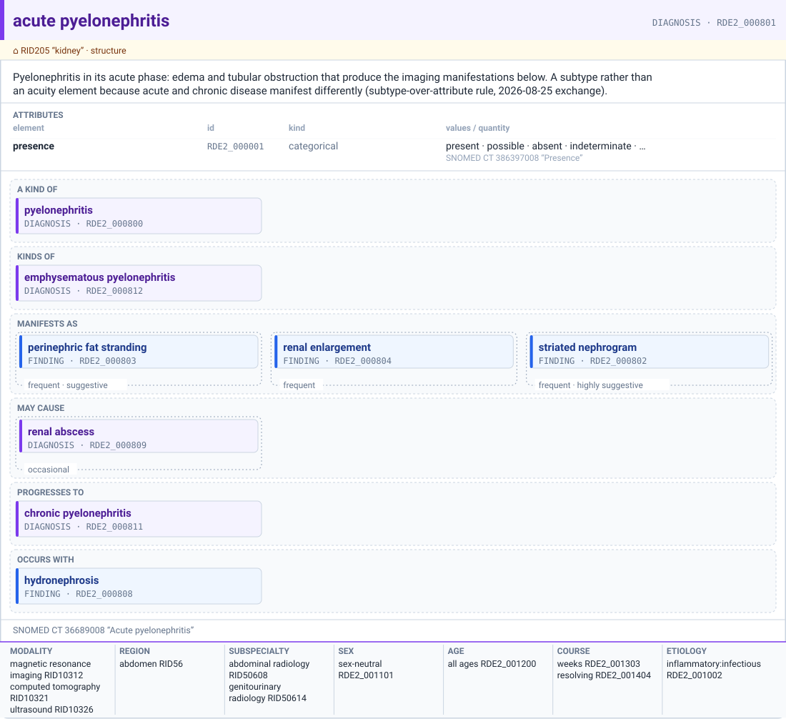
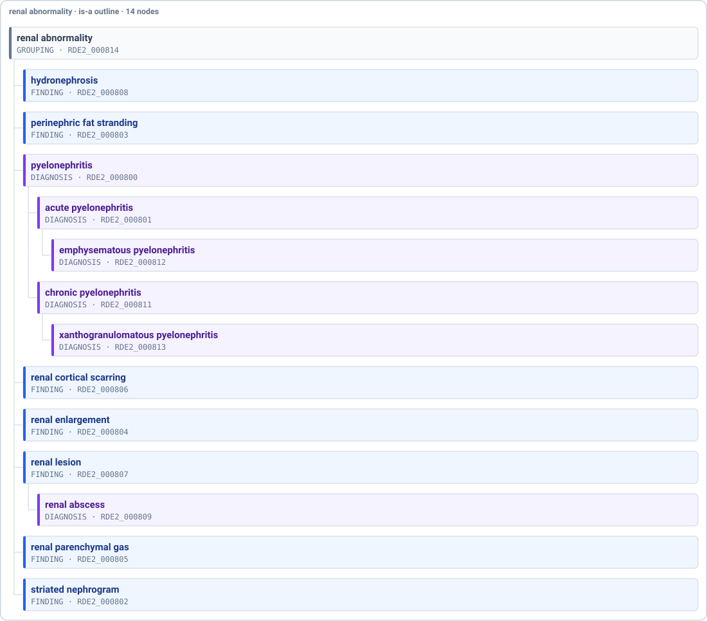
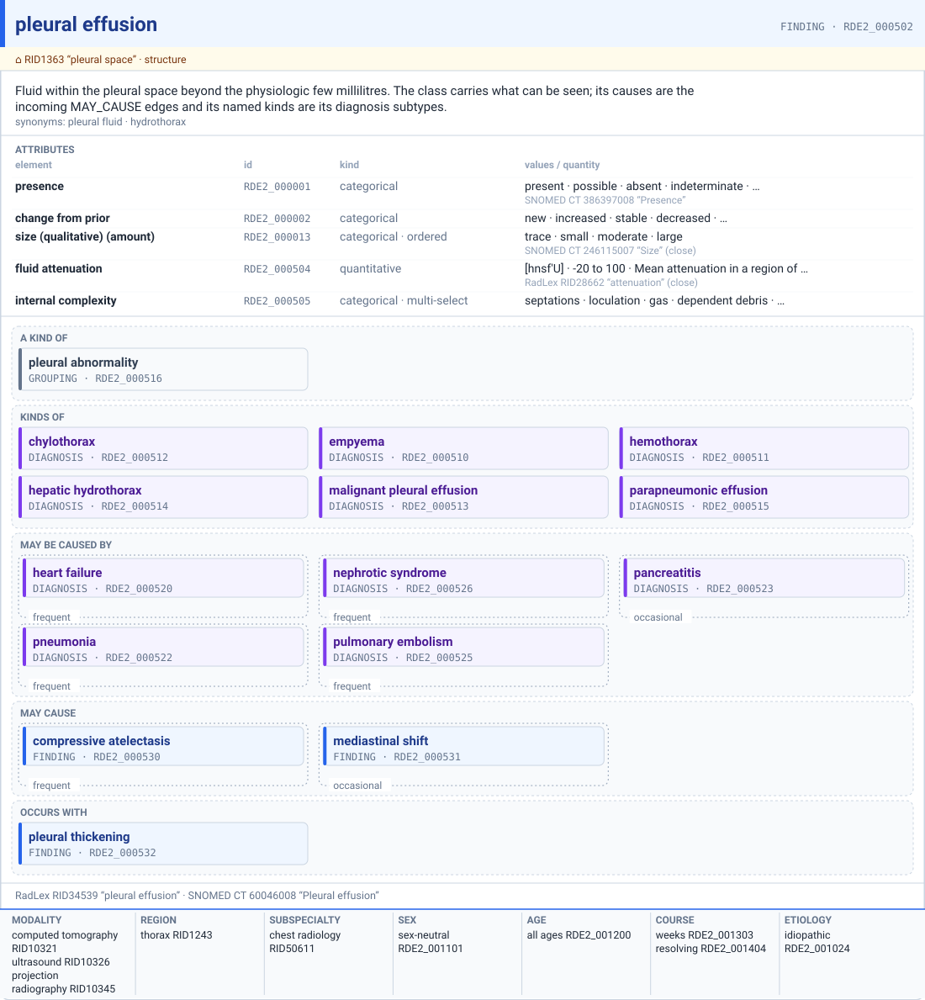
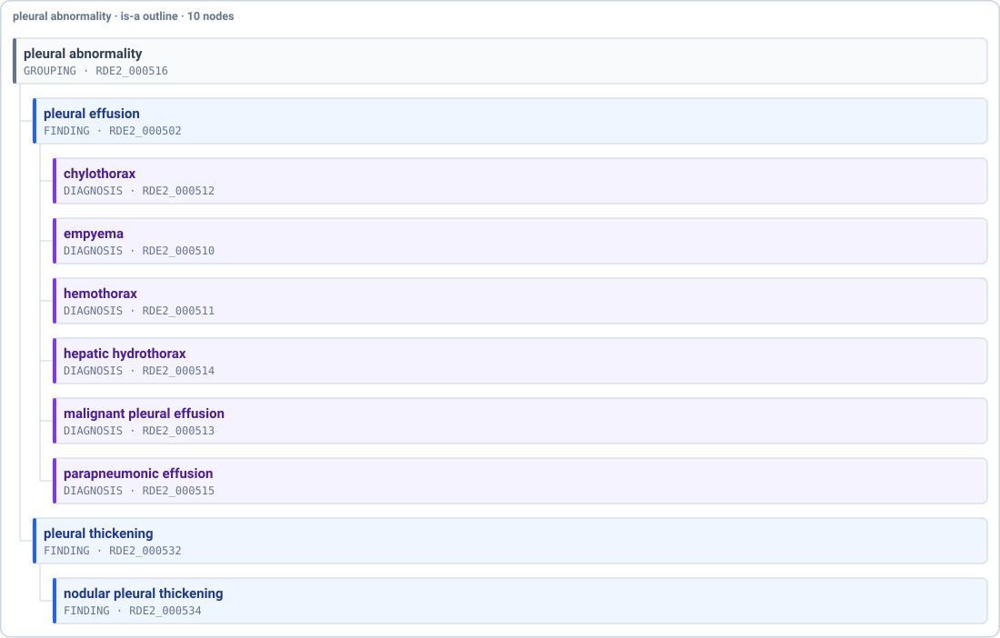
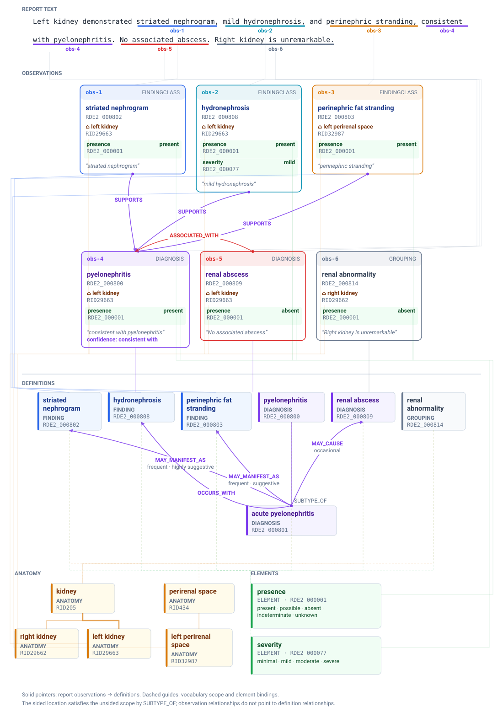

# Worked Examples, Acute Pyelonephritis, Pleural Effusion, and One Report

**Status:** Draft. The two examples exist as graph files ([`graph/pyelonephritis.jsonl`](graph/pyelonephritis.jsonl), [`graph/pleural-effusion.jsonl`](graph/pleural-effusion.jsonl)), as the mats and trees under `diagrams/` generated from those files by the renderer of [09](./09-mat-and-tree.md), and as pages in the generated site ([`graph/README.md`](graph/README.md) has the build commands). This document is about *content*: what each example exercises, what writing it broke, and where its facts came from. The structural decisions that writing them forced are recorded in [10](./10-decision-record-2026-09-02.md), sorted by provenance, and applied in [01](./01-what-the-vocabulary-must-express.md), [03](./03-draft-structures.md), and [07](./07-relationship-family.md).

**Read the provenance before trusting a number.** The owner chose the two examples and the effusion's cause list. Every typicality and specificity value, every `expected` hint, the subtype trees, the element choices, and the close-versus-exact code matches are Claude's clinical and terminological estimates, unreviewed (10 §C). The codes themselves were looked up, not invented.

## 1. The decisions these examples forced

Recorded in [10](./10-decision-record-2026-09-02.md) with the owner's words: one taxonomy unrestricted by the finding or diagnosis label (S1, S2); no inherited element bindings (S3); confidence in the report plane for findings and diagnoses alike (S4); lesion, mass, and process as patterns applied at a location, not nodes, and not in the graph (S5 to S7); Grouping as a narrow node type (S8); no required elements (S9); and the rendering-time propagation of scope and context down subtypes (S13, a Claude default).

## 2. Acute pyelonephritis

A diagnosis constituted by a constellation ([02 Q4 and Q5](./02-review-questions.md)). Twelve owned nodes and one grouping node, in [`graph/pyelonephritis.jsonl`](graph/pyelonephritis.jsonl).

**The diagnosis tree.** `pyelonephritis` (RadLex RID3547, SNOMED CT 45816000) with `acute pyelonephritis` and `chronic pyelonephritis` as subtypes, `emphysematous pyelonephritis` under acute, `xanthogranulomatous pyelonephritis` under chronic. Acute and chronic are subtypes, not an acuity element, by the rule from the [25 August exchange](../../notes/review-exchange-2026-08-25-extract.md): when the distinction would change the relationships, use a subtype. It does. Acute manifests as a striated nephrogram; chronic manifests as cortical scarring.

**The findings**, all under the `renal abnormality` grouping node and scoped to the kidney (RID205) or the perirenal space (RID434):

| Finding | Elements | Manifestation edge | typicality | specificity |
|---|---|---|---|---|
| striated nephrogram | presence, distribution | from acute | frequent | highly suggestive |
| perinephric fat stranding | presence, severity | from acute | frequent | suggestive |
| renal enlargement | presence; `INTERPRETED_FROM` the kidney length binding | from acute | frequent | (none) |
| renal parenchymal gas | presence | from emphysematous | obligate | pathognomonic |
| renal cortical scarring | presence, distribution | from chronic | very frequent | (none) |
| hydronephrosis | presence, severity | `OCCURS_WITH` acute | | |
| renal lesion | presence, size (mean diameter) | | | |

All three specificity values of [07 §3.2](./07-relationship-family.md) occur in one family, and two edges carry no specificity because the finding is nonspecific, which is the intended way to say so.

**The rest of the family.** `acute pyelonephritis MAY_CAUSE renal abscess`, typicality occasional, on the assumption that the causal pair takes typicality ([07 Q2](./07-relationship-family.md)). `renal abscess` is a Diagnosis and a `SUBTYPE_OF renal lesion`, the lesion pattern at the kidney (10 S6). `acute MAY_PROGRESS_TO chronic`, the identity-preserving case. Report pattern 1 of [02 Q4](./02-review-questions.md) stays legal: "pyelonephritis, left kidney" with no findings is a single Observation.

**Scope and context propagate down the taxonomy.** `acute pyelonephritis` carries no `SCOPED_TO` or context edges of its own; its mat shows the kidney and the modalities in gray as inherited from `pyelonephritis`. This is a declared rendering rule for `SCOPED_TO` and the seven context edge types only, taken on 2026-09-02 so that scope and context are asserted once per family rather than on every subtype; it is not element inheritance, which remains excluded (10 S3). The graph stays explicit; the propagation is derived at render time.

**There are no required elements.** The `required` property that earlier drafts carried on `HAS_ELEMENT` edges was removed from the graph, the specs, and the renderers on 2026-09-02; presence is an ordinary attribute row.

**Renal enlargement is the [03 §9](./03-draft-structures.md) pattern.** The `length` element (`RDE2_000092`) is bound to the unsided kidney by a `HAS_ELEMENT` edge that carries an id, `RDE2_000830`; `renal enlargement INTERPRETED_FROM RDE2_000830`. This resolves the binding-identity question in [06 §4](./06-next-steps.md): bindings that must be cited get `RDE2_` ids like relationships do. The text-anchored report sample is now the two-plane example in §4.

**What it broke, and how it was fixed:**

- `INTERPRETED_FROM` had domain Assessment in [07 §1](./07-relationship-family.md) but was already used from a FindingClass in [03 §9](./03-draft-structures.md). Its domain is widened to any class that interprets a measurement.
- RadLex has no striated nephrogram (nearest: spotted nephrogram, RID35573) and nothing for perinephric fat stranding. Both are candidates for upstream proposal and are marked as such on the nodes.
- The Hood list places `renal_abscess` under an untyped `renal_lesion`. Under 10 S8, renal lesion is positively reportable and stays a FindingClass; the abscess is a Diagnosis subtype of it, which the unrestricted taxonomy of 10 S1 allows.

## 3. Pleural effusion

One finding node, its diagnosis subtypes, and the causes that point at it. In [`graph/pleural-effusion.jsonl`](graph/pleural-effusion.jsonl).

**The class carries what can be seen.** `pleural effusion` (RadLex RID34539, SNOMED CT 60046008; synonyms pleural fluid, hydrothorax) is scoped to the pleural space, RadLex RID1363, which AnatomicLocations.org does not yet carry ([04](./04-anatomy-gaps.md)). Its elements: presence (required), change from prior, size (qualitative) as the amount, fluid attenuation as a measured quantity in Hounsfield units with the region-of-interest method in the definition, and internal complexity as a multi-select (septations, loculation, gas, dependent debris, fluid-fluid level). Simple versus complex is an interpretation of the last two, not a value.

**Six diagnosis subtypes** under the finding, each passing the "X without Y" test of 10 S2: parapneumonic effusion, empyema, hemothorax, chylothorax, hepatic hydrothorax, malignant pleural effusion. Parapneumonic effusion `MAY_PROGRESS_TO` empyema. Empyema manifests as the split pleura sign (frequent, highly suggestive) and as pleural thickening (very frequent, suggestive). Malignant effusion manifests as nodular pleural thickening (frequent, highly suggestive). The Hood list has hemothorax, chylothorax, and empyema as siblings of pleural effusion under an untyped parent; under 10 S1 they move down one level.

**Causes are edges, not properties.** Seven clinical diagnoses (heart failure, nephrotic syndrome, pulmonary embolism, pneumonia, pancreatitis, cirrhosis, malignant neoplastic disease) each `MAY_CAUSE` the effusion or one of its subtypes. This is what RadLex's own `May_Cause` and the Gamuts ontology do ([07 §6](./07-relationship-family.md)). The causes are Diagnosis nodes with a name, a definition, and mappings, and no elements, so that the edges have targets; that is the working answer to the question of whether non-imaging diagnoses belong in the graph, taken so the example could be written and open to reversal.

**What the causal edges carry.** Typicality, from the HPO bins. And a second, proposed property, `expected`: hints about the effusion's own values given the cause. Heart failure effusions are bilateral and right-dominant with simple fluid; hepatic hydrothorax is right-sided; pancreatitis effusions are left-sided; malignant effusions are large and recur after drainage. These narrow the derived differential more than typicality does, and they are what radiologists actually use. Structurally they are the conditionality question of the [25 August exchange](../../notes/review-exchange-2026-08-25-extract.md) appearing on relationships instead of elements: a value on one node conditioned on an edge to another. The property is keyed to the target's element names or to location; it is deliberately loose in this draft.

**Specificity is omitted on every causal edge.** An effusion points nowhere in particular; leaving the property off is how the model says so ([07 §3.2](./07-relationship-family.md)). Idiopathic is not an edge either: at class level it is `HAS_ETIOLOGY idiopathic`, at report level it is the absence of any expressed cause edge. Transudate versus exudate, which is how clinicians partition the causes, is not visible on imaging and belongs to the cause diagnoses, not to the effusion.

**The report sample** ([`examples/pleural-effusion.report.jsonl`](examples/pleural-effusion.report.jsonl)) has bilateral effusions as two Observations on the sided pleural spaces, compressive atelectasis caused by the larger one, heart failure asserted from the history with possible confidence, and empyema explicitly absent on the right.

## 4. One report, two planes

The two sentences produce six Observations in reading order: a present striated nephrogram; present mild hydronephrosis; present perinephric stranding; present pyelonephritis with the report's phrase “consistent with” retained as confidence; an absent renal abscess; and an absent renal abnormality from “Right kidney is unremarkable.” Each card points to what it is, where it is, and the data elements that carry its values. Every content value in this exercise is hypothetical.

The vocabulary scopes pyelonephritis, hydronephrosis, renal abscess, and renal abnormality to `kidney` (RID205). The left-sided report Observations point to `left kidney` (RID29663), and the unremarkable Observation points to `right kidney` (RID29662); each sided kidney's explicit `SUBTYPE_OF kidney` edge satisfies the unsided scope. Perinephric stranding works the same way: its Observation is in `left perirenal space` (RID32987), which is a subtype of `perirenal space` (RID434), where the class is scoped. Only anatomy touched by report locations, scope targets, and the is-a paths between them appears.

The sixth Observation gives the negative-only `renal abnormality` Grouping node a concrete report-plane role. Its presence value is `absent` at the right kidney, so “unremarkable” is a real Observation rather than an omitted positive finding, and the closed-world negation sweep of [03](./03-draft-structures.md) has an assertion to hang on.

The two relationship systems do different work. In definition space the committee states once that `acute pyelonephritis MAY_MANIFEST_AS striated nephrogram`: a standing potential between classes. In observation space “consistent with” is the radiologist putting these particular findings together as this particular diagnosis, represented provisionally by three `SUPPORTS` edges. The absent abscess is connected to the diagnosis Observation by `ASSOCIATED_WITH`; the absence is its presence value, not a negated edge. None of the report edges points to a vocabulary relationship. Their correspondence is visible in the parallel structures.

The JSON Lines ground truth is [`examples/pyelonephritis.report.jsonl`](examples/pyelonephritis.report.jsonl); `tools/render_report.py` validates it and generates the picture.

## 5. What the two examples share

- **Both need the Grouping node type** (10 S8): `renal abnormality` and `pleural abnormality`, each a negative-only parent of findings and diagnoses alike.
- **Both cross the finding-diagnosis line in the taxonomy** (10 S1): renal abscess under renal lesion, six diagnoses under pleural effusion.
- **Both leave context metadata as placeholders.** Etiology and modality edges point at `Scheme-slug` concept nodes, pending the resource of [06 §1](./06-next-steps.md).
- **Both surfaced RadLex gaps** that the upstream-proposal workflow should carry: striated nephrogram, perinephric fat stranding, chylothorax, and a pleural space node in AnatomicLocations.org.
- **Neither has an assessment.** No standardized scheme scores either family, which is the ordinary case and worth having on record.

## 6. Sources

Codes were looked up through the molu command-line tool against BioPortal and UMLS on 2026-09-01 and 2026-09-02, with exact-label matches preferred and near matches recorded as `closeMatch`. Malignant pleural effusion has no exact SNOMED CT concept returned by search and is left unmapped rather than guessed. The Hood taxonomies are the per-modality finding lists in the openimagingdata findingmodels repository, exported 2026-08-15; their shape and the numbers cited here are in [the profile](../../notes/hood-taxonomies-profile-2026-09-01.md).
