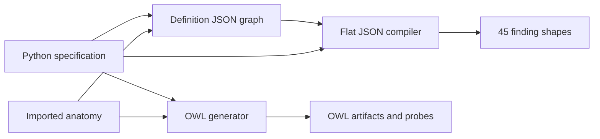

# Structural Comparison of the Alpha and the Working Discussions

The reviewer's implementation approach is the foundation going forward. This analysis identifies the structural contracts we need to agree on within that foundation. It does not propose returning to the earlier prototype, select clinical definitions, or implement a presentation redesign.

The owner set three tracks on 14 September: **structure first**, clinical content in a separate thread, and later adaptation of the reviewer's presentation layers toward the preferred **mat-based definition view**. Anatomic Locations is a priority within structure. Adoption of the implementation approach does not silently settle each semantic choice inside it.

## 1. Reading the evidence

**Agenda correction, 15 September (S50–S51).** Develop tissue-type scope (pulmonary/hepatic parenchyma, subcutaneous fat) and structure-type scope (solid organs, vessels with artery/vein subtypes, muscles, tendons, ligaments), including their connections to the location hierarchy. The assistant's suggested connection models remain exploratory. The original seven broad agenda questions are withdrawn as framed: Measurements already have Measurement nodes; Observations specify sided locations and can express absence through a component value referencing presence="absent". Plain-list OR / explicit AND is already the owner's S48 position. Missing taxonomy coverage belongs in anatomy gap work. OWL mapping, export metadata, and verification details below are retained as later implementation notes, not new structural decisions for this meeting. This does not remove specific apparent conflicts or proposals elsewhere in the comparison.

**Current framing (S49).** This is a discussion agenda for improving an alpha, not a compliance audit against a settled local model. Inheritance, finding/diagnosis types, and the component model are proposals to work through with the reviewer. Earlier owner instructions and prototype choices remain historical evidence; they do not establish joint agreement on the foundation. Suggested changes and acceptance probes below are conditional on agreeing the relevant meaning. An alpha omission is an opportunity to discuss, not proof of an incorrect implementation.

The alpha snapshot is `ae08188534fd59f1f38ed49e327355782c14bd9b`, preserved on a local review branch and in an isolated worktree. Its four commits only add `alpha/`; path-level inspection found no overlap with the local no-inheritance fix, so that fix appears merge-preservable. No merge was performed. The previous assessment's claim that a merge would undo that fix was unsupported.

The comparison uses the **current working discussion**, including S31–S37 and the proposed 13 September library plan. Several discussion files are uncommitted and newer than the alpha. The alpha's absence of a later requirement is often a chronological gap, not evidence that the reviewer rejected it.

**Anatomy revision boundary.** The [13 September exchange](../../notes/review-exchange-2026-09-13-extract.md), added to the workspace during this analysis, reports a substantial anatomy refactor and warns against investing in the old implementation. A fresh `git fetch origin` and remote-head check on 14 September still found `origin/next-gen-2026` at `ae08188`; the announced refactor was not present on that upstream branch. The code findings below describe this snapshot; they must be rechecked against the refactor when available. Use [The Anatomy Axis](11-anatomy-axis.md) as the current anatomy agreement. Historical implementation findings are evidence for acceptance probes, not instructions to repair superseded code.

Evidence is classified as:

| Status | How to read it |
|---|---|
| Owner decision | Historical instruction or owner–assistant acceptance; cite its number and scope. Not automatically a shared integration agreement (S49). |
| Shared agreement | Explicit agreement with the relevant collaborators; do not infer this from a prototype choice or owner preference. |
| Working direction | A documented requirement or proposed model without equally strong owner provenance. |
| Open decision | Alternatives remain unresolved; neither implementation settles the question. |
| Alpha behavior | What code or the reviewed artifact does, even when prose says otherwise. |
| Internal mismatch | Alpha paths disagree, or an artifact does not express the documented contract. |

The old documents also contain stale examples: `required` survives in parts of 03 after S9 removed it; 07 says report edges can cite definition relationships after S22 declined that; its component table predates S33. These examples are not new requirements to impose on the reviewer.

The following source keys identify exact files in the reviewed commit. Line numbers in the dossiers refer to those files; local discussion links refer to the current working documents.

| Key | Source |
|---|---|
| **S** | [Authored specification, `scripts/spec.py`][spec] |
| **J** | [Graph and consumer JSON generator, `scripts/build_json.py`][json] |
| **O** | [OWL generator, `scripts/build_owl.py`][owl] |
| **A** | [Anatomy extractor, `scripts/build_anatomy.py`][anatomy] |
| **G** | [Committed definition graph][graph] |
| **C** | [Committed aggregate consumer shapes][compiled] |
| **E** | [Graph evaluator, `scripts/evaluate_graph.py`][evaluator] |
| **V** | [Terminology verifier, `scripts/verify_codes.py`][verifier] |
| **P** | [Reasoner probes, `scripts/build_probes.py`][probes] |

## 2. What the implementation already gives us

The foundation is substantial: a Python specification, imported anatomy, a cross-referenced definition graph, flat consumer shapes, OWL serializations, generated documentation, and explicit probes. The reviewed graph contains 45 FindingClasses, 25 Diagnoses, 37 DataElements, 16 Measurements, 226 AnatomicLocations, and other vocabulary nodes: 553 nodes and 1,126 edges overall. Forty-five per-finding shapes are emitted.

Several principles align well with the discussions: shared elements have identity; their values belong to that element; patterns are authoring guidance; measurements carry methods; relationships have direction and properties; imported terminology is distinguished from local content; consumers receive generated representations. These should inform the analysis without assuming every current field or transformation is settled.

The implementation is **not yet one lossless path from a canonical graph to every output**. The JSON and OWL builders independently interpret the Python specification. The flat JSON compiler receives the graph but also reads element, measurement, and assessment information from specification structures. The visualization/documentation paths consume additional Turtle snapshots. This architecture can be developed further; its semantic parity needs an explicit contract.

The extra specification input to the flat compiler is consequential: generating JSON does not yet prove that a consumer possessing only that JSON can recover the same definition. The diagram describes the core generation paths, not a proposed replacement architecture.

## 3. Structural decision map

| ID | Decision area | Principal difference or gap | Prior authority |
|---|---|---|---|
| ST01 | Taxonomy and definition bindings | Alpha compiles inherited definition relationships; our initial proposal uses direct assertions without automatic propagation. | S3/S13 prototype history; open under S49 |
| ST02 | Applicability, existence, and reporting | Alpha uses existential OWL restrictions for applied elements; catalog applicability and report completeness need separate meanings. | Owner S9; formal mapping open |
| ST03 | Finding/diagnosis/grouping types | Alpha restricts taxonomy and makes finding/diagnosis classes disjoint; our proposed taxonomy can cross those labels. | S1, S4, S8; proposal under S49 |
| ST04 | Potential relationships and inference | “Non-inference-bearing” flags do not neutralize OWL restrictions. | Standing-potential framing in 07; S21–S22 |
| ST05 | Components and component-of scope | Alpha's qualitative component structure differs from our proposed min/max counts and component-of family scope. | S33–S35; proposal under S49 |
| ST06 | Anatomy source and identity | Alpha extracts a RadLex subset with local wrappers; the agreed substrate is the pinned Anatomic Locations data plus a taxonomy overlay. | Owner S12, S20, S37 |
| ST07 | Anatomy relations and scope | Scope kinds, containment, partonomy, taxonomic applicability, and refinement differ across code paths. | Owner S20, S31, S37; detailed rules open |
| ST08 | Laterality and normal-anatomy attributes | Alpha offers a laterality element and measurement-owned scope; discussions use sided locations and anatomy-owned bindings. | Owner S20; working direction in 00/01/03 |
| ST09 | Elements, measurements, and assessments | Alpha has separate node families; common binding behavior and interpretation links need agreement. | Working direction in 01/03; type split open |
| ST10 | Value sets and restrictions | Alpha narrows consumer choices, uses OWL value classes, and treats some restrictions as advisory. | Value ownership aligned; enforcement details open |
| ST11 | Standard clinical metadata | Alpha has selected dedicated types but omits several of the seven agreed dimensions and diagnosis export fields. | Owner S10–S11, S31 |
| ST12 | Canonical and published contracts | Alpha describes OWL as internal only; JSON and OWL are now intended deliverables consumed directly. | Owner/constraint S36 |
| ST13 | Identity and lifecycle | Sequential generated edge IDs, type-prefixed IDs, and build-time version metadata are not a durable identity/version contract. | RDE2 working direction; lifecycle open |
| ST14 | Terminology bindings | Rich anchoring machinery exists; release identity, match semantics, post-coordination, and artifact parity need tightening. | Code-lookup policy; source ownership direction |
| ST15 | Definition/observation boundary | Alpha tests definition logic but does not establish the full report-consumption contract. | Owner S19–S22, S29, S33, S35 |
| ST16 | Authoring guidance and evidence of correctness | Some lints encode stronger rules than agreed; passing checks cover less than their names suggest. | Owner S7, S35; S36 parity constraint |

## 4. Detailed comparisons

### ST01. Taxonomy and definition-binding propagation

**Discussion.** Our initial proposal separates classification from automatic propagation of elements, scope, metadata, and other definition bindings. S3/S13 governed the earlier prototype; S49 explicitly clarifies that inheritance has not been rejected for the foundation. Discuss what the alpha's inheritance achieves and whether directly authored bindings preserve the desired benefits. S20's applicability checks are a distinct operation from copying bindings.

**Alpha.** S:2199–2207 returns only directly authored content, but J:264–266 marks subtype edges `inheritance: "strict"`, and J:429–488 walks the ancestor chain when compiling shapes, including incoming diagnostic and causal relationships targeting ancestors. O:732 and O:759–834 express class inheritance and restrictions. The committed shapes contain **39 inherited element entries and 25 inherited measurement entries across 10 shapes**. This is executable behavior, not merely the label `inherited_from`.

**Decision to resolve.** What does the published taxonomy classify, and where are catalog relationships represented? A true subclass relation can coexist with independently authored definition bindings if those bindings are modeled at the definition level rather than turned indiscriminately into restrictions on all clinical instances. Removing `rdfs:subClassOf` altogether is not the only option. The mapping must state which consequences are intended: the current mappings of element applicability, scope, and potential relationships to OWL restrictions need an explicit semantic justification.

**Acceptance probe.** Give parent A one element, scope, modality, and potential relationship; give subtype B none. B's definition view contains no new direct bindings. Separately, a B classification may satisfy a request for an A, without generating bindings on B. Run both questions against JSON, OWL-facing queries, and the future access libraries.

### ST02. Separate applicable attributes, logical existence, and stated values

**Current status (S51):** retained for later OWL mapping checks against the existing definition/Observation distinction. The broad question is withdrawn from the structural meeting agenda; no new domain decision is established here.

**Discussion.** S9 says there is no required element. S4 says node types impose no reporting obligations. The definition tells consumers what can characterize a finding; a report says which values were stated.

**Alpha.** O:759–776 and O:910–912 translate applied elements and measurements into existential restrictions. If a clinical entity belongs to that class, some filler exists for each restricted property in every satisfying OWL interpretation. Missing explicit RDF values do **not** by themselves violate the ontology: OWL can satisfy an existential with an unnamed filler. The previous assessment's blanket claim that this directly makes fields mandatory in reports was too strong. The [OWL primer][owl-primer] distinguishes logical existence from syntactic completeness.

**Why it matters.** A property that applies to a definition, a property an entity necessarily has, and a property recorded in a report answer different questions. If the ontology models report assertions, inferred fillers are especially liable to be mistaken for recorded data. If it models clinical entities, the same axiom has a different reading. Neither reading is made safe merely by hiding an “inherited” label.

**Decision to resolve.** Define `HAS_DATA_ELEMENT` and `HAS_MEASUREMENT` as catalog applicability, clinical necessity, or another explicit relation. Identify the OWL representation appropriate to that meaning. Report completeness must remain a separately named concern.

**Acceptance probe.** A report that states an entity but supplies no optional attribute remains a valid partial report. Querying recorded values returns none. A reasoner must not cause an unstated value or observation to appear in the consumer output. Test explicit absence, missing data, and an unknown value separately.

### ST03. Treat node labels and taxonomic membership deliberately

**Discussion.** Our proposal allows taxonomy across FindingClass, Diagnosis, and Grouping labels (S1), without attaching reporting obligations to those labels (S4). S49 asks how to bring these useful ideas into the foundation, not to treat type organization as settled. Grouping's exact negative-only type formulation was partly an unopposed proposal (S8); the negative observation use case is explicitly requested (S29).

**Alpha.** J:264–266 emits subtype links only while building FindingClasses. O:445–446 declares FindingClass and Diagnosis disjoint, along with other classes. The probe set deliberately expects a finding that is also a diagnosis to be unsatisfiable. `OCCURS_WITH` also has a same-type lint, whereas the discussed relation admits either finding or diagnosis endpoints. A table of signatures observed in a sample graph is not, by itself, a declaration of all allowed signatures; the generator and lints provide the stronger evidence here.

**Why it matters.** Adding a cross-label subtype to this OWL hierarchy can make that subclass empty. This is a general structural issue independent of which diagnosis belongs beneath which finding. Clinical examples demonstrating it stay in the content backlog.

**Decision to resolve.** Are these labels categories of definition records, disjoint kinds of clinical entities, or roles that influence available relations? Specify permitted endpoints for each relation independently of the example corpus. Decide where Grouping participates without assuming a closed-world negation sweep.

**Acceptance probe.** Use abstract definitions A and B with different labels and an explicitly allowed subtype relation. A should remain satisfiable under the chosen representation. An allowed cross-label association should survive every serializer and query interface.

### ST04. Make “may” and “non-inference-bearing” mean what consumers expect

**Current status (S51):** retain this evidence for later export mapping work. It is not a separate broad structural question for the meeting or a claim about the refactor's current behavior.

**Discussion.** 07 describes class-level potentials, not assertions that particular findings or diagnoses must occur. S21 separates a radiologist's report-level interpretation from those standing potentials. S22 declines an obligatory pointer from a report relationship to its definition counterpart.

**Alpha.** O:887–902 emits existential restrictions for manifestation, causation, progression, and co-occurrence. `inferenceBearing: false` and `epistemic` are custom annotations. They document an intention but do not disable the semantics of the surrounding OWL axioms. The [OWL structural specification][owl-syntax] explicitly separates annotations from logical meaning.

The precise issue is not that `mayCause` necessarily means an actual cause: a domain-specific potential relation could have that name. It is that an existential then entails a related target individual in each interpretation, and the inverse/symmetric/property restrictions retain their ordinary logical consequences. This differs from an independently governed statement connecting two definition records. Typicality and specificity annotations do not modify those quantifiers.

**Decision to resolve.** Choose a representation for potential relationships and their properties; say which parts are logical axioms and which are definition data. Write separate contracts for inverse lookup, subtype applicability, causal direction, and actual report relationships. Keep progression open where temporal identity is unresolved.

**Acceptance probe.** Record “A may manifest as B” with a strength annotation, then state an A observation. No B observation should be fabricated. A definition query from B can find A with the original relationship ID, direction, and strength. Repeat for causation and symmetric association.

### ST05. Proposed component counts and container scope

**Discussion.** The component proposal developed in S33–S35 uses `HAS_COMPONENT`/`COMPONENT_OF`, min/max counts from the container, optional **component-of scope** from the component, and family-specific component classes. The proposed scope check uses container classification without copying edges. S49 makes the integration status explicit: bring these forward as potentially useful modifications to the alpha, not a settled replacement. Multi-component measurements are a separate exploratory idea.

**Alpha.** S uses a `components` list with qualitative strength, a singular `component_of`, and a separate `component` flag. J:296–308 exports `strength` and `direction`; J:493–519 compiles a single container reference. O declares `componentOf` functional and inverse to `hasComponent`, and represents components with existential restrictions (O:799–804). An existential whole-to-part link supplies a minimum of one, not a general min/max count. Functionality in the inverse direction supplies at most one whole per component; it neither defines a family scope nor says how many components a whole can have.

**Decision to resolve.** Define count fields including zero and unbounded maximum; distinguish allowed container classes from a link between particular component/whole observations; align the standalone eligibility flag with component-of scope; decide whether a component can belong to more than one whole. Keep ontological counts separate from how many components a partial report happens to mention.

**Acceptance probes.** Exercise 0..many, 1..1, and 2..4 without clinical names. An eligible container subtype satisfies component-of scope without acquiring a new definition edge. A component outside that family is rejected by the scope contract. A report may omit mention of a necessarily existing component; omitting a description does not assert nonexistence.

### ST06. Build anatomy on the agreed substrate and preserve ownership

**Discussion.** S37 selects the data underlying `anatomic-locations`, referenced at a pinned commit, with RadLex supplying an initial taxonomy/structure-type overlay. Missing sided variants are part of a separate RadLex track. S12 favors the existing RID identity; S20 requires sided and unsided anatomy to relate taxonomically. The pinned source is recorded in [SOURCES](../../notes/SOURCES.md).

**Alpha.** A extracts selected RadLex seeds, their hierarchy, relation targets, and local additions. It reads a machine-local OWL file/cache (A:33–34, 73–80), while S declares release `4.3`; a release label is present, but this path does not establish a content-pinned input. J creates local `AL-` identifiers alongside RID bindings; O uses local anatomy IRIs. This is an implemented imported-anatomy module, but it does not yet implement the selected Anatomic Locations dependency and its richer relation/variant structure.

**Decision to resolve.** Separate the external anatomy resource, our referencing/import layer, and our proposed extensions. Agree which identifier is canonical in stored definitions, exports, and library queries, and how an unresolved/temporary anatomy identifier is reconciled when RadLex supplies one. Specify the pinned releases needed to reproduce a definition's anatomical meaning.

**Acceptance probe.** Resolve the same anatomy reference through an authored definition, JSON, OWL, and the access library. It returns one source identity and its provenance. Upgrading an anatomy release must not silently turn an identifier into another location or alter previously pinned definition semantics.

### ST07. Keep taxonomy, partonomy, containment, and applicability distinct

**Owner working position S48, qualified by S49.** Plain scope lists match any one target by default (OR), with explicit combinations supporting multiple conditions together (AND). This arose as an open contract question, not a verified defect in the current foundation. Bring the intended behavior to the reviewer for discussion; do not infer a jointly adopted contract or required implementation change.

**Discussion.** S31 names anatomic scope as either a place or a kind of structure. S20's sided-to-unsided example is taxonomic applicability. S37 identifies the missing structure-type/is-a layer as a major shortcoming to address. The earlier library plan's combined `SUBTYPE_OF`/`PART_OF` closure is a proposal, not an agreed rule for every scope kind.

**Alpha.** `specific`, `region`, and `class` are different scope kinds. The anatomy extractor distinguishes imported partonomy senses and spatial containment; O keeps `containedIn` outside the `scopedToRegion o partOf` chain. However, J's refinement walk combines is-a, part-of, and local edges without distinguishing relation semantics (J:57–81), and S's scope lint also combines those paths (S:2235–2261). JSON has no literal `CONTAINED_IN` edge: it encodes containment as `PART_OF` plus `props.sense: "containedIn"` (16 observed edges; J:124–129), whereas OWL uses a separate property. O:300–306's comment says containment is not imported, yet O:312–322 and O:375–377 declare and emit it. These are internal representation/documentation mismatches, not evidence that containment was entirely lost.

**Questions for discussion after S48.** Consider a relation-by-relation applicability table covering paths, direction, identity, and incomplete anatomy. Bring forward the owner's preference for default any-match lists and explicit all-match conditions, keeping combination logic distinct from traversal rules. Distinguish derived body-region facets from source assertions and evidence of scope satisfaction. Discuss refinement by both structure kind and containing anatomy.

**Acceptance probes.** A sided organ satisfies its unsided class scope; a part is not automatically a subtype of its whole; a structure contained in a region is not automatically part of it; a refinement of the right kind but in the wrong organ fails applicability; missing taxonomy yields an explicit unresolved result rather than assumed success. Compare containment predicate, direction, provenance, and exclusion from partonomy closure across JSON and OWL. These are proposed semantic tests for agreement, not newly adopted rules.

**Scope-combination acceptance probe (S48, for ST07).** A candidate satisfying A but not B matches a plain list [A, B] and does not satisfy an explicit requirement to match both A and B. A candidate satisfying both matches either form. Preserve this distinction across every promised representation; this is a future check, not a claimed current test result.

### ST08. Locate laterality and normal-structure descriptors consistently

**Subsequent owner decision S43.** AnatomicLocation can bind directly to DataElements and Measurements. This settles the anatomy-originating binding direction; it neither prohibits descriptor-owned scope nor decides how to encode either. Laterality and detailed applicability paths remain separate questions.

**Discussion.** 00 and 01 place laterality in the AnatomicLocation pointer and describe attributes bound directly to normal anatomy. S20 confirms use of a sided location on a specific Observation. These discussions do not require an abnormal finding merely to report a normal anatomical measurement.

**Alpha.** S:746–760 defines a laterality DataElement, including bilateral. Anatomical scope may also point to pre-coordinated sided anatomy. O:676–683 explicitly presents measurement-owned scope as an alternative to anatomy-originating measurement bindings; the committed graph has one scoped Measurement, renal length. Its scope survives in the graph but is omitted from compiled measurement entries (J:545–552). The alpha acknowledges that a bilateral value does not resolve whether the report describes one entity or two.

**Existing answer and later implementation checks (S51).** An Observation specifies a sided anatomic location; this is not an open choice to present again. Checking export/query behavior or detecting contradictory side information is downstream work. Keep descriptor applicability, measured location, and method landmarks distinct without reopening the Observation model.

**Future implementation probes, not additional meeting questions.** A normal-anatomy measurement is representable without a FindingClass. An unsided measurement definition applies to a sided location through an agreed taxonomic path. Check side/landmark handling against the existing Observation model when implementation work resumes.

### ST09. Decide what separates DataElement, Measurement, and AssessmentScheme

**Subsequent owner decision S39.** The Measurement/DataElement distinction is accepted. Measurement method is optional and unspecified by default. This settles the type split between those two, not AssessmentScheme modeling, shared interfaces, method-specific identity, or serialization. The snapshot findings below remain historical evidence rather than a fresh review of the held branch.

**Subsequent owner decision S40.** AssessmentScheme is also accepted as a separate definition type, with a structural change: it should have edges to multiple DataElement-like descriptors, much as FindingClass does. The scheme must be distinguished from its descriptive dimensions and their value sets. Reusing DataElement and Measurement is under discussion; exact edge types, nested structures, scoring, and report-result representation remain open. This direction must not be reduced to one scheme-level category enumeration.

**Subsequent owner decision S41.** The scheme's descriptors are ordinary DataElements, not an assessment-specific type. This resolves that part of S40; quantitative components, exact binding relationships, nesting, scoring, and report-result representation remain open.

**Exploratory discussion item, not a proposal or decision.** The owner asks to put forward multi-component measurements as an idea instead of advancing the suggested derived-measurement input links. How components are represented and how composition relates to derivation remain open. The inspected alpha already mentions component measurements as well as derivation links; no absence in its current implementation is asserted. See [the discussion agenda](../plans/2026-09-14-structural-decision-agenda.md), ST09d.

**Discussion before S39–S40.** 01 requires measurement, method, and interpretation to remain separable. The earlier 03 model expressed quantitative measurements as DataElements and assessments largely as finding definitions. That representation was a working model, not an argument against the reviewer's separate node types; its type choices are superseded by the decisions above.

**Alpha.** Categorical DataElements, quantitative Measurements, and AssessmentSchemes are independent types. Measurements have quantity kind, units, method, optional component measurements, and derivation links (J:175–190; O:652–683). The current Measurement node shape does not declare a numeric datatype or bounds; OWL carries units and method as annotations. This describes the measurement definition but does not yet specify a typed numeric consumer contract. Assessment schemes have their own authority, version, scheme scope (`observation` or `exam`), and categories (J:192–204; O:685–713). Their separate authored `applies_to` field is not exported. Category records are embedded in JSON and separate classes in OWL. `INTERPRETED_FROM` has no counterpart; `DERIVED_FROM_MEASUREMENT` connects quantitative definitions, not an interpretation to its input binding.

The assessment mapping also repeats ST02's distinction: an applicable scheme becomes `assessedBy some Scheme` on each finding instance (O:777–778), and every scheme instance must have some category filler for **each** category (O:685–713). This is a logical existence model, not merely a list of available schemes and permissible categories. The contract must explain whether a scheme individual denotes a catalog object, an assessment event, or something else; 07 places selection of the applicable scheme in study/exam context.

**Agenda correction (S51).** Measurement nodes already represent measurements. The broad question about what defines a measurement did not establish another structural difference and is withdrawn. Interface, numeric-field, and serialization checks are later implementation work. The multi-element AssessmentScheme proposal and exploratory multi-component Measurement idea remain separate, explicitly identified discussion items.

**Acceptance probes.** A Measurement with no specified method remains valid and round-trips without acquiring a default method. Explicitly supplied methods remain distinguishable even when units match; whether this requires separate measurement identities is still open. A numeric fixture preserves its declared datatype, bounds, units, missingness, and special-value policy through each promised consumer interface. A raw numeric report does not acquire an ordinal interpretation. Two assessment versions can coexist and an observation can identify which it used without acquiring assessments under every available scheme. A category has a stable machine reference across all deliverables. Scheme scope and `applies_to` survive export or have a documented intentional omission. A reference to an input binding can be resolved without copying its value.

### ST10. Give value domains and binding restrictions one contract

**Subsequent owner decision S39.** DataElement value sets may be ordered or unordered, and the distinction must be explicit. A list's display order does not establish semantic ordering. This does not yet choose the encoding or change the example artifacts.

**Subsequent owner decision S42.** A FindingClass's binding may restrict a shared DataElement to a subset of its permissible values. This is an explicit definition-level restriction, not just a display preference, and does not alter the shared element or its other bindings. Encoding and enforcement mechanisms remain open; narrowing does not propagate through taxonomy.

**Subsequent owner proposal S44.** Put default selection cardinality on DataElement with possible adjustment on the binding edge. This is a proposal for discussion, not a finalized contract. Whether adjustments can broaden or only narrow cardinality remains open; no required report elements or taxonomy inheritance are implied.

**Subsequent owner decisions S45/S47.** Distinguish the finding's modality visibility, a descriptor's modality applicability in a particular finding's binding, and the descriptor's intrinsic modality limits. The intrinsic limit is not an overridable default. Both DataElements and Measurements participate in this distinction. Missing modality constraints mean **no information**, not pan-modality applicability or a claim that no modality applies. Representation and inconsistency handling remain open.

**Discussion.** Value ownership and element reuse align between the approaches. Ordering and multi-select are meaningful structural features. The enforcement boundary between vocabulary semantics, authoring guidance, and report-template validation remains important.

**Alpha.** JSON has Value nodes, one owner per value, ranks on `HAS_VALUE`, and `single`/`multi` cardinality. OWL turns each value into a class, closes the value domain with a union, declares sibling value classes disjoint, and uses functional element properties for single-select (O:569–650). J:525–545 filters allowed choices by a binding's `narrow` list; OWL records narrowing as an annotation (O:764–772). Global element modality becomes an OWL property domain restriction; per-use modality is an annotation on the shared property (O:587–603, 805–808).

**Class identity versus descriptive attributes; clarified by S46.** The alpha supports `defined` classes whose `differentia` are necessary-and-sufficient property conditions (O:824–837), so supplying a value can cause classification into a named subtype. The owner clarified that a given categorization in the same model should use either a categorizing DataElement or a taxonomy, not both. In the taxonomy representation the categorizing element is absent, not merely hidden on the mat. S30 already permits different contexts to choose different representations. The assistant's question combining "B is exactly A with E = V" has been withdrawn as framed. This does not decide every possible use of formal class axioms; individual clinical definitions remain in the content workstream.

**Decisions still to resolve after S42/S45/S47.** Specify value identity separately from its display label and chosen report representation. Define how each delivery format preserves the binding-local subset's meaning; the restriction is no longer an open advisory-versus-semantic choice. Keep restrictions direct under S3. Represent the three modality statements separately, including a resolvable binding-specific constraint; preserve missing information without expanding it to all modalities, and decide how inconsistent combinations are surfaced.

**Acceptance probes.** Renaming a value preserves stored answers. Two bindings to one shared element can have different permitted modalities/value subsets without changing each other. Test single-select, multi-select, exclusive “none,” unknown values, and ordering independently. Distinguish an OWL class of value realizations from the concrete permissible-value code returned to a report consumer. For a categorization modeled as named subtypes, the equivalent categorizing DataElement is absent from the definition, not merely hidden by presentation; unrelated direct descriptor bindings remain intact.

### ST11. Preserve all seven dimensions of standard clinical metadata

**Current status (S51):** export metadata coverage is later implementation work, not an additional structural question for the meeting.

**Modality acceptance probe (S47, for ST10 and ST11).** Round-trip a definition with unspecified modality applicability: it remains unspecified, not "all" or "none." A missing statement at one level does not erase an explicit limitation at another. This does not decide a UI filtering policy or how empty collections are encoded.

**Discussion.** S10–S11 establish shared concept nodes, and S31 names the seven dimensions: modality, body region, subspecialty, sex, age, time course, and etiology. This is structural coverage; choosing the correct values for an individual definition is content work.

S45 further distinguishes the finding's modality metadata from descriptor-intrinsic modality limits and binding-specific modality applicability. One finding-level list cannot stand in for all three.

**Alpha.** Dedicated Modality, Subspecialty, and Etiology types cover part of the requirement. Age, sex, and time-course applicability are deferred; body region is described as derived from anatomy. Finding and diagnosis builders expose different subsets of relations (J:283–294 versus J:362–387). The shape compiler emits findings only, so it cannot yet supply an equivalent diagnosis definition contract.

**Decision to resolve.** Specify available metadata for each relevant definition type, the identity/source of its concepts, and how absent/unknown/not-applicable are represented. Decide whether region is authored, derived, or both with provenance; do not let changing anatomy silently masquerade as an authored change to clinical metadata.

**Acceptance probe.** A nonclinical fixture populated with all seven dimensions can be queried from either delivery format, with direct and derived facts distinguishable. A missing dimension remains missing rather than inheriting a parent default.

### ST12. Establish what is canonical and what each deliverable promises

**Discussion.** S36 expects JSON and a directly consumable graph form, probably OWL, plus Python and TypeScript access. The graph cannot leave meaning resolvable only in authoring code. The library plan proposes a database copy and typed access but its storage, package, and detailed API choices remain proposals.

**Alpha.** SHAPE labels the graph internal, flat finding shapes vendor-facing, and OWL design-time only. J:408–563 uses both graph data and specification structures; O independently builds from S. Flat shapes omit some relationship identity/properties and reference diagnoses that have no corresponding compiled diagnosis object. Some source fields only survive in one output.

**Decision to resolve.** Choose the canonical authored representation and a normalized semantic contract, then classify each output as a full representation or a documented projection. Every publicly promised datum must be retrievable without private Python structures. A compact consumer view may be intentionally lossy if it declares its limits and preserves references to the full representation.

**Acceptance probe.** Starting with a published graph alone, answer the same definition, binding, scope, and relationship questions as the Python authoring layer. Rebuild the compact view from that public input. Compare semantics with stable IDs, not formatting or triple counts alone. Publication of OWL does not imply requiring every vendor to run a reasoner.

**Incremental export suggestions for discussion (S49).** These build on the alpha's existing export paths. They are not an instruction to replace its generators or a claim about the held refactor's current behavior.

1. **Preserve relationship detail.** Retain source, target, relationship identity, and authored properties in the full export. Let compact views link back to the relationship rather than losing its meaning when flattening. Include binding-local value subsets, modality limits, and component counts if those structural proposals are adopted.
2. **Make references usable across definition types.** Supply a lookup/index or full-graph reference for every referenced definition, including diagnoses and descriptors. A finding-only convenience view can remain finding-only; it need not duplicate every type into the same shape.
3. **Carry authored information without inventing defaults.** Identify fields presently omitted by each exporter and either carry them through or document the omission. If our proposed omission semantics are adopted, an unspecified method stays unspecified and missing modality information does not become "all modalities." New fields depend on agreement about their meanings.
4. **Describe what each file promises.** Add a short export guide identifying full representations versus compact views, how IDs/references resolve, which information is intentionally omitted, and how a consumer retrieves it. This need not introduce a new canonical architecture, access library, or versioning framework; versioning remains deferred.
5. **Check a few shared examples across formats.** Start with the same definition and relationship queried from JSON and RDF/OWL. Add one shared element with two different binding subsets, a missing method/modality, and a multi-element AssessmentScheme as those meanings are agreed. Compare the answers, not textual identity. These small checks can expose loss or semantic drift without making every consumer run a reasoner.

**The OWL question in ordinary language.** "This descriptor is available for this finding," "every instance has a related value/entity," and "this report records a value" are different statements. The reviewed snapshot uses existential restrictions, which assert that a related entity exists; this does not require a report to explicitly supply it ([OWL primer][owl-primer]). Similarly, a potential relationship between definitions needs an agreed meaning before choosing logical axioms. A custom "non-inference-bearing" annotation does not switch off the axiom's OWL consequences ([OWL syntax][owl-syntax]). Suggestion: write the intended sentence for each relationship and check a tiny example together before deciding its export mapping. This is a clarification topic, not a rejection of OWL or a demonstrated defect in the current refactor.

### ST13. Make identity and lifecycle survive ordinary edits

**Discussion.** 00 Issue E records a shared RDE2 lineage namespace, with type represented as data and value IDs owned by their element. The exact URI authority, registry, migration rules, and version-node model remain open. Important edges have their own identity; lifecycle history is intended to be distinct from domain semantics.

**Alpha.** Namespaces are type-prefixed. J:43–54 assigns edge IDs by traversal sequence. Inserting an earlier edge shifts later IDs; an ID's presence does not make it durable. J:20–23 stamps current build dates, version 1, and a common contributor on records. OWL IRIs are derived from specification symbols and, for some entities, labels. These are adequate prototype identifiers but do not yet establish edit-stable references or historical reproducibility.

**Decision to resolve.** Define persistent IDs, version IDs, source-release identity, and build identity separately. Specify what changes when a definition is relabeled, retyped, split, retired, or replaced, and what an old report continues to reference. Decide whether imported edges require stable identity as well as source-release provenance.

**Acceptance probes.** Insert an unrelated early definition/edge; every untouched relationship keeps its identity. Rename a label; stored references still resolve. Rebuild unchanged source on another day without claiming all definitions were edited. Load two releases and resolve a report against the release it used.

### ST14. Keep rich terminology anchoring while making its semantics exact

**Discussion.** The code-lookup policy requires genuine source concepts and their preferred terms. Broader source ownership and versioning are part of the graph's governance. Same wording is evidence to inspect, not proof of semantic equivalence.

**Alpha.** Bindings include system, code, source label/version, match strength, and sometimes a primary flag. Anchor verdicts are `anchored`, `post_coordinated`, `structurally_expressed`, `unanchored_requestable`, and `out_of_primary_scope`: they distinguish direct anchoring, composition, structural expression, potential terminology requests, and material outside the primary terminology's scope. This gives the implementation a useful basis. However, J:26–36 and O's binding helper use different source-version conventions; some source metadata is dropped or shortened in compact exports. Post-coordination records a head plus modifier list without fully typed roles. The verifier accepts loose mappings and uses word-stem similarity for some label differences (V:90–116).

**Decision to resolve.** Specify the meaning/direction of mapping strengths, the primary-binding rule, release identifiers for each terminology, and the machine-readable semantics of a compositional anchor. Make “verified” distinguish code existence, label agreement, declared approximate mapping, heuristic relatedness, and expert semantic validation. SKOS mapping properties describe semantic relationships, not string-comparison results ([SKOS reference][skos]).

**Acceptance probes.** An approximate mapping and its exact anchor verdict survive every export. A SNOMED binding retains its own release rather than RadLex's version. Two modifiers in different roles do not become interchangeable. A code may pass lexical checks without being promoted to expert-confirmed equivalence.

### ST15. Define the consumer boundary without building a new report system

**Owner clarification (S51).** An Observation can point to a FindingClass with a component value referencing the presence DataElement and value "absent." The broad report-consumer question is withdrawn from the meeting agenda; the analysis below is retained only to guide future mapping checks against this existing working-model answer.

**Discussion.** S19–S22 describe report Observations, anatomy references, stated values, text provenance, and distinct observation-space relationships. S29 gives a negative grouping use case. S33–S35 add component scope and plurality consequences. The grammar remains a separate responsibility.

**Alpha.** The implementation intentionally contains no worked report instances; class-level probes are its evidence. `UnresolvedMention` and `ScopeResolution` begin to describe extraction/statement state, while the stated domain remains definitions. Absence of report instances is not itself a structural disagreement: a definition library need not become a reporting system. It does mean some claimed representational capabilities have not been demonstrated at the intended consumption boundary.

There is also a dormant instance-generation path: O:963–1016 types the example individual directly as its FindingClass. S19 instead describes an Observation that **points to** a FindingClass. These are not interchangeable if the class denotes clinical entities: an assertion that a finding is absent must not itself become an instance of that finding. This is a latent mapping issue, not a claim that current artifacts contain erroneous report observations.

**Decision to resolve.** Agree the minimal contract the definitions expose to a report consumer: what IDs can be report subjects, how normal anatomy and diagnosis assertions are referenced, how a component refers to its container, and how category negation differs from an absent named finding. Keep confidence, extraction failure, and unresolved mention state in a clearly identified module/plane. Do not infer diagnoses or negative descendants from incomplete reports.

**Acceptance probes.** A report can refer to a finding, diagnosis, grouping, or normal anatomy through an agreed subject contract. An absent-finding Observation refers to its subject concept without asserting a clinical instance of that class, unless class extensions have explicitly been defined as observation assertions. Definition queries never fabricate observed entities. Category negation and remainder negation remain distinct; a vocabulary hierarchy alone does not prove what a radiologist assessed. Conjunction of observations supporting a diagnosis is not silently substituted for independent definition relationships.

### ST16. Align authoring guidance and tests with the agreed semantics

**Current status (S51):** verification details belong to later implementation work. The owner withdrew the broad "what does a passing check establish?" question from this structural agenda.

**Discussion.** S7 keeps patterns in authoring guidance and lint. S35 calls a binary presence-shaped element a **potential** smell; it may be legitimate when it describes an attribute rather than a separate describable entity.

**Alpha.** Topic-only patterns align well. S:2277–2283 flags every noncanonical element whose labels are only present/absent/yes/no. S:2215–2221 treats identical labels as duplicate value sets, without considering differing meanings. These are useful review prompts, but neither establishes a universally invalid structure. S:2232–2235 skips anatomy scope checking when `anatomy.json` is absent; it is absent in the parked checkout. The earlier “clean lint” result therefore did not establish that all scope checks passed. E:242–267's OWL-agreement check detects certain misplaced scope/modality restrictions, not full graph/OWL semantic equivalence.

Some reasoning probes also test less than their descriptions claim. P:98–131 includes the expected superclass directly in A1, A2, A4, and A5, so finding that ancestor cannot establish that the advertised scope chain worked. [`test_probes.py`:13–19][probe-tests] accepts any nontrivial ancestor for group A, rather than requiring each intended inferred target; A6 can therefore pass without establishing its advertised more-specific classification. Other tests, such as E9, do check an exact target. This is a coverage distinction, not a dismissal of the probe approach.

**Decision to resolve.** For each rule, say whether it is a hard invariant, advisory authoring prompt, or experiment. Record skipped prerequisites separately from passed checks. Add small discriminating probes for the contracts agreed above; do not use a reasoner-consistent ontology as proof that it matches the intended model.

**Acceptance probe.** A justified binary attribute can receive a documented review disposition. Missing anatomy prevents a complete scope-verification claim. An intentional JSON/OWL mismatch in binding applicability, relation identity, or a value restriction is caught by the relevant parity check even when both files parse successfully. A reasoning test requires the exact intended entailment and fails when the mechanism being tested is removed; its target must not already be asserted by the fixture.

## 5. Anatomy discussion agenda

The anatomy work should establish these contracts before selecting or adding clinical examples:

1. **Authority and releases:** pinned Anatomic Locations substrate; exact RadLex overlay; ownership of local extension proposals and replacement mapping.
2. **Identity:** source RID, temporary variant ID, local wrapper, and OWL IRI roles; preservation across releases.
3. **Relationship algebra:** taxonomy, whole/part, spatial containment, laterality variant links, region membership; explicitly permitted path combinations.
4. **Scope:** place versus structure type; scope strength; alternatives versus conjunctions; application of a subtype; incomplete knowledge behavior.
5. **Refinement:** allowed kind plus allowed location; sided/unsided variants; source expansion without accidental broadening.
6. **Normal anatomy:** discoverable descriptors; measurement scope versus measured subject; landmarks and methods that reference more than one place.
7. **Public representation:** equivalent answers from JSON, OWL, and access libraries; any derived closure identified as derived with its source release.

Anatomical taxonomy coverage and clinical taxonomy semantics are related but separate. Extending an anatomy is-a overlay must not become a back door for inheriting definition bindings.

## 6. Presentation and content tracks, parked separately

### Presentation: mat-based definition views

The owner's preferred direction is already established. A later plan should adapt the reviewer's presentation layers to a mat centered on one definition with linked cards grouped by relationship, a separate taxonomic tree, and consistent compact metadata/hover behavior, using [09](09-mat-and-tree.md) as evidence of the preferred interaction.

The structural prerequisite is an adequate public query contract: center definition identity/type, directly asserted bindings, typed and directed incident relationships, relationship properties, anatomy references, standard clinical metadata, and source mappings. A mat must be able to distinguish direct facts from an explicitly requested applicability/derived view. Whether cards use a particular layout, color, or wire treatment is a presentation decision. No presentation code is changed in this analysis.

### Clinical content: a separate review thread

Park individual disease-family classifications, the pleural examples, nodule composition choices, clinical definitions, modality assignments, measurement conventions, severity scales, and code selection here. A structural fixture may use an existing example to expose a count or type issue, but this report does not decide what that example should clinically say. S30's general rule about when a class deserves separate identity informs structure; its specific pulmonary taxonomy remains content work.

### Implementation operations

Dependency packaging, machine-specific paths, Taskfile commands, large source-file storage, and deployment are implementation tasks after the structural contracts are understood. Their absence is not a semantic defect. This analysis does not make a build-system rewrite the prerequisite to discussing the model.

## 7. Recommended order of agreement

The current meeting order is **anatomy first**, then specific apparent active conflicts, explicit improvement proposals, and the genuinely unresolved anatomy connections. S50 adds tissue-type and structure-type scope families. S51 removes the broad Measurement/Observation questions and puts OWL mapping, export metadata, and verification in later implementation work. The definition/Observation distinction already supplies the working-model answer; do not present it as a fresh general question.

Discuss component-of scope, descriptor reuse, and multi-element assessment structure as proposals for improving the foundation. Preserve the reasons for unresolved conflicts without treating a prototype choice as a jointly adopted rule. Versioning remains deferred; delivery parity can be checked when the relevant implementation work resumes.

For each decision, record the intended meaning, permitted inference, counterexample that must fail, handling of unknown/missing data, and representation in each deliverable. Retain the reviewer's implementation architecture and use these agreements to guide its evolution. A suggestion in this report is not an approved semantic change.

## 8. Verification and limits

This is a source/artifact analysis with read-only probes. The earlier inspection ran graph structural checks and terminology verification; this pass qualifies their coverage and compares implementation behavior with newer decisions. No complete rebuild or new reasoner run is claimed. Syntax validation and reasoning consistency are different from agreement with the intended structural contract.

The report records checked behavior and proposed acceptance probes separately. Clinical accuracy remains outside this review. The dated decision record, not stale illustrative syntax in older documents, establishes whether a requirement was explicitly chosen.

[spec]: https://github.com/RSNA/ACR-RSNA-CDEs/blob/ae08188534fd59f1f38ed49e327355782c14bd9b/docs/next-gen-schema/alpha/scripts/spec.py
[json]: https://github.com/RSNA/ACR-RSNA-CDEs/blob/ae08188534fd59f1f38ed49e327355782c14bd9b/docs/next-gen-schema/alpha/scripts/build_json.py
[owl]: https://github.com/RSNA/ACR-RSNA-CDEs/blob/ae08188534fd59f1f38ed49e327355782c14bd9b/docs/next-gen-schema/alpha/scripts/build_owl.py
[anatomy]: https://github.com/RSNA/ACR-RSNA-CDEs/blob/ae08188534fd59f1f38ed49e327355782c14bd9b/docs/next-gen-schema/alpha/scripts/build_anatomy.py
[graph]: https://github.com/RSNA/ACR-RSNA-CDEs/blob/ae08188534fd59f1f38ed49e327355782c14bd9b/docs/next-gen-schema/alpha/graph/definition-graph.json
[compiled]: https://github.com/RSNA/ACR-RSNA-CDEs/blob/ae08188534fd59f1f38ed49e327355782c14bd9b/docs/next-gen-schema/alpha/compiled/_all-findings.json
[evaluator]: https://github.com/RSNA/ACR-RSNA-CDEs/blob/ae08188534fd59f1f38ed49e327355782c14bd9b/docs/next-gen-schema/alpha/scripts/evaluate_graph.py
[verifier]: https://github.com/RSNA/ACR-RSNA-CDEs/blob/ae08188534fd59f1f38ed49e327355782c14bd9b/docs/next-gen-schema/alpha/scripts/verify_codes.py
[probes]: https://github.com/RSNA/ACR-RSNA-CDEs/blob/ae08188534fd59f1f38ed49e327355782c14bd9b/docs/next-gen-schema/alpha/scripts/build_probes.py
[probe-tests]: https://github.com/RSNA/ACR-RSNA-CDEs/blob/ae08188534fd59f1f38ed49e327355782c14bd9b/docs/next-gen-schema/alpha/scripts/test_probes.py
[owl-primer]: https://www.w3.org/TR/owl2-primer/#Property_Restrictions
[owl-syntax]: https://www.w3.org/TR/owl2-syntax/#Annotations
[skos]: https://www.w3.org/TR/skos-reference/#mapping
