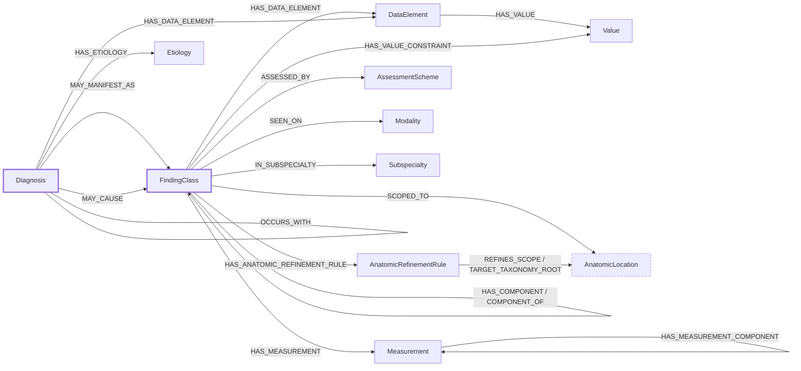

# The shape of the knowledge graph

What the definition layer is made of, and what it reaches. Generated from the build
on 2026-09-14 by `scripts/build_shape.py`; every count and edge signature is
derived from the artifacts. Do not hand-edit.

What each mechanism does and why is in `MECHANISMS.md`. How to run it is in `README.md`.

**Alternative term** records another name or framing in circulation for the same
object. A blank means the concept exists on one side only.

---

## 1. Layers

| Layer | Artifact | Contains | Goes to |
|---|---|---|---|
| Authoring | `scripts/spec.py` | patterns, lint rules, content source | internal |
| Definition graph | `graph/definition-graph.json` | 347 nodes, 758 edges, cross-referenced | internal |
| Compiled | `compiled/*.json` | 45 flat shapes, references resolved | **vendors** |
| Reasoning check | `radcde-*.ttl` | the same content as OWL | design-time only |

**There are no instances.** Claims about what the model can hold are made by probes,
which state a construction and let the reasoner return the verdict. Instance-level
validation needs representations authored by a radiologist or produced by something that
reads text; neither exists here.

Patterns never appear below the authoring layer. The OWL is a checking instrument
rather than a deliverable, not something consumers reason over.

## 2. How it connects

Edge properties are omitted here; they are listed in full under Edges. Thick borders
are the two node types the model is about. The dashed one is imported
rather than authored. Native RadLex relationships are documented separately in
`RADLEX-SHAPE.md`; they are not CDE-defined edges and are never flattened into CDE proxies.

## 3. Nodes

| Type | n | What it is | Alternative term |
|---|---:|---|---|
| `Value` | 155 | One coded permissible answer. Belongs to exactly one DataElement. | — |
| `FindingClass` | 45 | A discrete observable entity. What a radiologist reports seeing. | — |
| `DataElement` | 36 | A named attribute with a closed list of permitted answers. | Element |
| `AnatomicLocation` | 28 | A CDE role occupied by native RadLex anatomy concepts. | Anatomy |
| `Diagnosis` | 25 | What a radiologist may conclude. Reached from findings, never asserted by one. | — |
| `Subspecialty` | 19 | A radiology subspecialty. | — |
| `Measurement` | 16 | A quantitative attribute carrying its own method and units. | quantitative DataElement |
| `Etiology` | 10 | A kind of cause. Target for HAS_ETIOLOGY. | — |
| `Modality` | 7 | An imaging technique. | — |
| `AssessmentScheme` | 5 | A named scheme with an issuing authority and its own version clock. | Assessment |
| `AnatomicRefinementRule` | 1 | An explicit rule separating eligible anatomy targets, permitted native RadLex predicates, and traversal behavior. | — |

| Considered, not in the graph | Would be | Status |
|---|---|---|
| `Grouping` | A node asserted only in the negative, so that 'no renal abnormality' has something to point at. It would never be used positively. | **Unresolved, not rejected.** Negating a *named* finding already works: presence absent on the finding. What has no answer is negating a *category*, where no finding is named and nothing carries the presence value. Grouping remains a live candidate that has not been worked through. Two things would need settling: whether one negative node per organ scales, and how remainder negation works, since 'no other significant adenopathy' needs a scope over what was examined rather than a node to point at. |

## 4. Edges

Signatures are the tail and head types observed in the build, not everything the
edge is permitted to take.

| Edge | Signature | n | Properties | Alternative term |
|---|---|---:|---|---|
| **ASSESSED_BY** | `Diagnosis`→`AssessmentScheme` `FindingClass`→`AssessmentScheme` | 5 | — | ASSESSES (inverse) |
| **COMPONENT_OF** | `FindingClass`→`FindingClass` | 2 | — | MAY_BE_COMPONENT_OF |
| **DERIVED_FROM_MEASUREMENT** | `Measurement`→`Measurement` | 2 | — | — |
| **HAS_ANATOMIC_REFINEMENT_RULE** | `FindingClass`→`AnatomicRefinementRule` | 1 | — | — |
| **HAS_COMPONENT** | `FindingClass`→`FindingClass` | 1 | — | MAY_HAVE_COMPONENT |
| **HAS_DATA_ELEMENT** | `Diagnosis`→`DataElement` `FindingClass`→`DataElement` | 170 | `modality`, `narrow`, `note` | HAS_ELEMENT |
| **HAS_ETIOLOGY** | `Diagnosis`→`Etiology` | 25 | — | — |
| **HAS_MEASUREMENT** | `FindingClass`→`Measurement` | 41 | — | — |
| **HAS_MEASUREMENT_COMPONENT** | `Measurement`→`Measurement` | 2 | — | — |
| **HAS_VALUE** | `DataElement`→`Value` | 155 | `exclusive`, `rank` | member |
| **HAS_VALUE_CONSTRAINT** | `FindingClass`→`Value` | 9 | `defining`, `element`, `note` | — |
| **IN_SUBSPECIALTY** | `FindingClass`→`Subspecialty` | 32 | — | — |
| **MAY_CAUSE** | `Diagnosis`→`Diagnosis` `Diagnosis`→`FindingClass` | 10 | `typicality` | MAY_BE_CAUSED_BY (inverse) |
| **MAY_MANIFEST_AS** | `Diagnosis`→`FindingClass` | 38 | `specificity`, `typicality` | MAY_REPRESENT (inverse) |
| **MAY_PROGRESS_TO** | `Diagnosis`→`Diagnosis` | 1 | — | MAY_PROGRESS_FROM (inverse) |
| **OCCURS_WITH** | `FindingClass`→`FindingClass` | 4 | — | — |
| **REFINES_SCOPE** | `AnatomicRefinementRule`→`AnatomicLocation` | 1 | — | — |
| **SCOPED_TO** | `DataElement`→`AnatomicLocation` `Diagnosis`→`AnatomicLocation` `FindingClass`→`AnatomicLocation` `Measurement`→`AnatomicLocation` | 71 | `kind`, `strength` | IN_REGION |
| **SEEN_ON** | `DataElement`→`Modality` `FindingClass`→`Modality` | 177 | — | — |
| **SUBTYPE_OF** | `FindingClass`→`FindingClass` | 10 | — | HAS_SUBTYPE (inverse) |
| **TARGET_TAXONOMY_ROOT** | `AnatomicRefinementRule`→`AnatomicLocation` | 1 | `include_descendants`, `include_root` | — |

- **ASSESSED_BY** — A standardized scheme applies to the source.
- **COMPONENT_OF** — This sub-part belongs only to that whole; says nothing about whether the whole has one.
- **DERIVED_FROM_MEASUREMENT** — Relates a computed Measurement to its inputs.
- **HAS_ANATOMIC_REFINEMENT_RULE** — Links a definition to an explicit anatomic refinement rule.
- **HAS_COMPONENT** — The whole must have this sub-part.
- **HAS_DATA_ELEMENT** — Applies an element. May narrow the permitted values, never widen them.
- **HAS_ETIOLOGY** — The kind of cause behind a definition.
- **HAS_MEASUREMENT** — Applies a Measurement.
- **HAS_MEASUREMENT_COMPONENT** — Relates a composite Measurement to its parts.
- **HAS_VALUE** — Binds a Value to its owning DataElement. Exactly one per Value.
- **HAS_VALUE_CONSTRAINT** — Fixes an applicable DataElement to one Value on a FindingClass. The `defining` property distinguishes a necessary fixed value from one participating in a necessary-and-sufficient class definition.
- **IN_SUBSPECIALTY** — The subspecialty a finding belongs to.
- **MAY_CAUSE** — Causal. The source produces the target as a distinct second entity.
- **MAY_MANIFEST_AS** — Evidential. The diagnosis can show itself as the target.
- **MAY_PROGRESS_TO** — Temporal. Authored progression from one Diagnosis to another.
- **OCCURS_WITH** — Symmetric, between two findings or two diagnoses. Seen together; asserts nothing about cause or sequence. Stored once; consumers traverse the predicate in both directions.
- **REFINES_SCOPE** — Identifies which authored scope entry a refinement rule narrows.
- **SCOPED_TO** — Anatomic scope. `kind` records an authored scope category and does not select a RadLex predicate or traversal.
- **SEEN_ON** — The imaging techniques a finding is seen on.
- **SUBTYPE_OF** — Taxonomy, more to less specific. Strict monotonic inheritance.
- **TARGET_TAXONOMY_ROOT** — Names a native RadLex taxonomy root used only to define eligible target concepts.

| Considered, not in the graph | Would be | Status |
|---|---|---|
| `IN_REGION` | Coarse body region, authored alongside SCOPED_TO. | Not adopted. Native RadLex relationships remain available from the scope target under their exact native predicates; no second regional assertion is authored. |
| `MAY_BE_RELATED_TO` | Symmetric catch-all for an association not yet typed. | Declared, unused. A triage queue, not a home. |
| `INTERPRETED_FROM` | Relates an interpretation to what it was read from. | Not adopted. Meaning shifts depending on how many things it points at. |
| `SEX, AGE_APPLICABILITY, TIME_COURSE` | Demographic and temporal applicability. | Deferred. |

### HAS_VALUE_CONSTRAINT examples

`HAS_VALUE_CONSTRAINT` represents a model assertion that one applicable DataElement is fixed to one Value for a FindingClass. The edge points directly to that Value and its `element` property identifies the DataElement property being fixed. Whether a particular clinical assertion is sufficiently established to use this mechanism is a separate modeling decision.

Two current patterns make the distinction explicit:

- **Pulmonary nodule attenuation.** `SolidPulmonaryNodule`, `PartSolidPulmonaryNodule`, and `NonSolidPulmonaryNodule` constrain the inherited attenuation axis to solid, part-solid, and non-solid respectively. These constraints are `defining=true` because they participate in the defined subtype equivalence.
- **Intracranial haemorrhage collection shape, provisional mechanism test.** The current alpha models `EpiduralHematoma` with biconvex, `SubduralHematoma` with crescentic, and `SubarachnoidHemorrhage` with conforming as `defining=false` fixed constraints. `IntraventricularHemorrhage` and `IntraparenchymalHemorrhage` instead provisionally narrow the inherited value set to conforming or rounded. This division is intentionally being used to exercise the difference between a fixed value and an open narrow. It has **not been validated by a radiologist** and must not be read as an authoritative clinical partition; the final assignments may change after clinical review.

When the model uses a fixed constraint, that element is omitted from the class's compiled/presented element choices, even when the DataElement is inherited from its parent. The modeled constraint remains in the definition graph and OWL. In the haemorrhage example, this behavior is being tested provisionally and does not imply clinical validation of the assignments.

### Edge properties

| Property | Meaning                                                                                                                            |
|---|------------------------------------------------------------------------------------------------------------------------------------|
| `defining` | True where a HAS_VALUE_CONSTRAINT participates in a necessary-and-sufficient class definition.                                     |
| `element` | Identifies which DataElement a HAS_VALUE_CONSTRAINT fixes.                                                                         |
| `exclusive` | True where selecting this value excludes every sibling value of the same multi-select DataElement.                                 |
| `include_descendants` | Whether native taxonomy descendants are eligible targets.                                                                          |
| `include_root` | Whether a taxonomy root itself is an eligible target.                                                                              |
| `kind` | specific, region, or class. Records the authored scope category. It does not select a native RadLex predicate or traversal policy. |
| `modality` | Restricts a DataElement attachment to some of the modalities on which the finding is seen.                                         |
| `narrow` | The subset of values permitted for that DataElement in this context. Advisory in alpha.                                            |
| `note` | Human-readable annotation for a relationship where additional context is needed. It has no formal semantic effect.                 |
| `rank` | Position in an ordered value list. Should be present on every value of an element or on none.                                      |
| `specificity` | suggestive, highly_suggestive, pathognomonic. Reads backward: how much seeing the target narrows the differential toward the source.                        |
| `strength` | required, expected, or unconstrained. How binding an authored SCOPED_TO claim is.                                                                     |
| `typicality` | occasional, frequent, very_frequent, obligate. Reads forward: how often the source shows or produces the target.                               |

758 of 758 edges carry an id and a version block, so a relationship can
change without either endpoint changing. Native RadLex anatomy relations are not copied
into the canonical definition graph; they remain in the RadLex-derived index.

## 5. Authoring patterns

Authoring patterns are **not part of the ontology**. They are not nodes, classes, edges,
DataElements, axioms, or compiled FindingClass content. They are optional authoring
guidance documented here because this file also describes the authoring layer. A pattern
lists broad topics an author may consider. It names no DataElement and inserts nothing.
An author may use one, compose considerations through `applies_with`, or use no pattern
when none fits. Reuse is never forced.

| Pattern | With | Topics |
|---|---|---|
| `focal-lesion` | — | margin, size, distribution, calcification |
| `nodule` | focal-lesion | none |
| `mass` | focal-lesion | composition, enhancement, effect on adjacent structures |
| `cyst` | focal-lesion | wall character, internal contents, composition |
| `diffuse-parenchymal-process` | — | extent, distribution, attenuation/signal character |
| `volume-change` | — | direction (increase/decrease), degree, symmetry |
| `collection` | — | amount, internal complexity, shape, evolution/age |
| `luminal-caliber-change` | — | direction (narrowed/dilated), degree, length involved |
| `fracture` | — | displacement, comminution, acuity |
| `soft-tissue-tear` | — | thickness/degree, partial vs. full-thickness, retraction |
| `displacement` | — | direction, distance |
| `device` | — | integrity, tip position |
| `anatomic-variant` | — | presence |
| `lymphadenopathy` | — | short-axis size, number, nodal architecture |

A pattern must not hold element ids and splice them into a FindingClass.
That forces a shared element onto classes it does not suit, and the only way to make one
fit is to widen it: a single `margin` element reaching nine values across three
societies, so that a tendon lesion can be reported as having extra-thyroidal extension.
Published elements must not move to accommodate new findings.

`nodule` intentionally contributes no new topic. It uses the `focal-lesion` size topic;
the nodule-versus-mass distinction is a size threshold on that topic, not a separate one.

`applies_with` composes authoring considerations only. It does not assert subclassing,
inheritance, or any other ontology relationship, and it does not attach DataElements.

The useful part is discoverability, which may be anatomy-aware in a future authoring tool.
That is application behavior, not ontology semantics.

### Authoring checks

Advisory. None is enforced by a reasoner and none constrains what an author may write.

| Rule | Says |
|---|---|
| `no-single-value-narrowing` | A narrow list never reduces an element to one value. An element every user answers the same way is not recording an observation, it is restating the class definition, and belongs in the definition instead. |
| `location-anchored` | A FindingClass says where it is, unless it is reached only through HAS_COMPONENT and takes its location from the whole that contains it. It does so either with its own SCOPED_TO, or by inheriting one from a parent. A class with neither describes a shape without saying where, which is a topic rather than a finding. |
| `presence-in-disguise` | An element whose values are only present and absent is a finding wearing an element's clothes. The thing being asserted belongs in the graph as a FindingClass or a Diagnosis, and its presence is then carried by the presence element every finding already has. |
| `narrowing-applies` | A narrow list names an element the class actually carries. Narrowing an element the class does not apply is dead configuration that reads as a constraint. |
| `no-duplicate-value-sets` | Two elements must not carry identical value sets. If they do, they are one element under two names, or one of them was split without the split producing any difference. |
| `element-scope-agrees` | An element or measurement that carries its own anatomic scope is only attached to a class whose scope is the same location or below it. Attaching thyroid margin to a renal cyst, or renal length to a pulmonary nodule, is not caught by anything else. A class may sit BELOW the scope: carotid stenosis at the internal carotid artery may use a measurement scoped to artery. CAVEAT: a measurement may also be defined against a landmark in another anatomic context, as NASCET divides by the diameter of the distal internal carotid rather than the segment being measured. That is not worked out and this rule assumes one scope is the whole story. |
| `no-ancestor-overlap` | A diagnosis does not point at both a class and one of its ancestors. The subtype inherits the ancestor edge, so it would carry two claims at once, and if their strengths differ nothing says which applies. Point at the level where the claim actually holds: all the subtypes, or the parent, not both. |
| `occurs-with-same-type` | OCCURS_WITH relates two findings or two diagnoses. Between a diagnosis and a finding a more specific edge already exists (MAY_MANIFEST_AS or MAY_CAUSE), so reaching for co-occurrence there is declining to say which. |

Currently **clean**.

## 6. Terminology bindings and RadLex composition

Terminology bindings are peers. The model does not designate a primary or secondary terminology.
When a CDE concept is not represented by one exact RadLex concept but can be expressed
compositionally, `radlex_composition` records the RadLex base and modifiers explicitly.

37 nodes currently carry a RadLex composition.

## 7. What the model holds, and where it stops

Four report sentences against the compiled shapes. Nothing here is stored: the sentences
are read against the model as it stands, and each table is generated from the shape the
class compiles to. Two work, one works partly, one does not.

### 1. A solid pulmonary nodule &nbsp;&nbsp; `HOLDS`

> *There is a 5 mm solid pulmonary nodule in the right upper lobe.*

| | |
|---|---|
| FindingClass | `FC-000005` pulmonary nodule |
| Scope | lung (region/required) |
| Elements | presence, interval change, pulmonary margin, distribution, calcification, attenuation, FDG avidity (0 inherited) |
| Measurements | long-axis diameter, lesion count, mean diameter |
| Diagnoses it may represent | metastatic disease |

Every part lands. The site is a lobe and the scope claim is against the lung, satisfied
through explicitly authored refinement semantics. No native RadLex relationship is selected merely from a scope kind. Stating the attenuation is enough
to reach the subtype: probe `A3` asserts a pulmonary nodule with part-solid attenuation
and the reasoner returns `PartSolidPulmonaryNodule`, with no subtype asserted anywhere.

The one thing the sentence underspecifies is the model's problem too: it says 5 mm and
not which diameter, and the class offers both a long-axis and a mean diameter.

### 2. A pleural effusion &nbsp;&nbsp; `HOLDS IN PART`

> *Moderate left pleural effusion, in the setting of pneumonia.*

| | |
|---|---|
| FindingClass | `FC-000021` pleural effusion |
| Scope | pleural space (specific/required) |
| Elements | presence, interval change, amount, internal complexity (0 inherited) |
| Measurements | volume, attenuation (Hounsfield units) |
| Diagnoses it may represent | empyema, hemothorax, chylothorax, parapneumonic effusion, malignant pleural effusion |

The non-focal morphology is representable, including amount. The left-sided location is
representable only when the configured native RadLex anatomy provides an appropriate sided
location or relationship. The CDE model does not add a side field to fill that gap.

The pneumonia link is a **`MAY_CAUSE`**, not a `MAY_MANIFEST_AS`. Pneumonia does not show
itself as an effusion, it produces one, and the two edges exist to keep those apart.
`LungCancer` reaches this same class both ways, manifesting as a nodule and causing an
effusion, which is where an author has to tell them apart.

### 3. Acute pyelonephritis &nbsp;&nbsp; `HOLDS IN PART`

> *Striated nephrogram with perinephric stranding and an enlarged left kidney.*

| Finding | typicality | specificity |
|---|---|---|
| StriatedNephrogram | frequent | highly_suggestive |
| PerinephricStranding | frequent | suggestive |
| RenalEnlargement | frequent | suggestive |

All three findings are representable and each edge carries its strength. What cannot be
said is what makes the diagnosis: no single manifestation is sufficient, and it is the
combination that is diagnostic. Every edge is binary, so the model records three
independent claims.

`specificity` grades each finding alone, which is not the same thing: a striated
nephrogram is `highly_suggestive`, perinephric stranding only `suggestive`, because
stranding also occurs in obstruction, trauma and infarct. Whether combining them belongs
in the vocabulary or in whatever consumes it is undecided.

### 4. Several rib fractures &nbsp;&nbsp; `DOES NOT HOLD`

> *Nondisplaced fractures of the left fourth through seventh ribs.*

| | |
|---|---|
| FindingClass | `FC-000037` rib fracture |
| Scope | rib (class/required) |
| Elements | presence, interval change, fracture displacement, comminution, acuity (0 inherited) |
| Measurements | displacement distance |
| Diagnoses it may represent | — |

One rib fracture is fine. Four are not. The class carries no count and no distribution,
so it cannot say how many, and even where a count exists it says how many rather than
which. Nothing enumerates members and nothing attaches an attribute to one of them, so
*the left fourth through seventh* and *the largest measuring 8 mm* both fall out.

## 8. Coverage

What a radiologist can say, against what the model can hold. The target is report
language, not current extractor output.

### Representable — 25

| Phenomenon | Where |
|---|---|
| Discrete focal lesion | PulmonaryNodule, ThyroidNodule, RenalMass. |
| Fluid or gas collection in a space | PleuralEffusion, Pneumothorax, IntracranialHemorrhage. |
| Parenchymal alteration without borders | Consolidation, StriatedNephrogram, WhiteMatterHyperintensity. |
| Volume loss or gain | Atelectasis, CerebralAtrophy, RenalEnlargement. |
| Luminal narrowing or dilation | CarotidStenosis, Hydronephrosis. |
| Material inside a lumen | PulmonaryArteryFillingDefect. |
| Break in a continuous structure | RibFracture. |
| Structure displaced from position | MidlineShift, MediastinalShift. |
| Device and its tip position | VentricularShuntCatheter. |
| Anatomic variant, explicitly not disease | AzygosFissure. |
| Anatomic scope at any granularity | SCOPED_TO with kind specific, region or class. |
| Sub-organ position, as 'in the right upper lobe' | AnatomicRefinementRule. Eligible target concepts are defined independently from any native RadLex predicate or traversal behavior. The pulmonary-nodule rule currently uses the lobe-of-lung taxonomy target set and deliberately authors no predicate. |
| Body region for filtering | Available from native RadLex context; not authored as a separate CDE region edge. |
| Sidedness of a finding | Carried by the resolved native RadLex anatomy when a sided concept is available. No separate CDE side element or local fallback is authored. |
| Interval change against a prior | DE-000015. Coarse: new, unchanged, increased, decreased. |
| Quantitative measurement with method | 13 Measurement nodes carrying units and method. |
| Assessment category | 5 schemes with issuing authority and their own version clock. |
| Ordered severity | rank on every value of an element, or on none. |
| Multi-select element | hasCalcification, hasInternalComplexity, hasNodalArchitecture. |
| One diagnosis suggested by one finding | MAY_MANIFEST_AS with typicality and specificity. |
| A cause producing a finding | MAY_CAUSE with typicality and expected appearance. |
| Kind of cause | HAS_ETIOLOGY to 10 Etiology nodes. |
| Sub-finding with its own attributes | SolidComponentOfPartSolidNodule, MuralNodule. |
| Conditional sub-finding, either direction | HAS_COMPONENT and COMPONENT_OF. |
| Negation of a named finding | `presence: absent` on the finding. 'No pleural effusion' is PleuralEffusion with presence absent, whose definition reads: can be confidently categorized as absent based on the data presented. Distinct from `unknown`, which records that the examination did not address it. |

### Partial — 6

| Phenomenon | Where |
|---|---|
| Diagnosis from several findings together | Every edge is binary. specificity grades each finding, but nothing says a conjunction is stronger than any member. See section 7, pyelonephritis. |
| Identity-preserving progression | MAY_PROGRESS_TO is authored for explicit progression pairs, but the ontology does not infer temporal identity beyond the stated relationship. |
| Acute versus chronic | As a temporal-descriptor value on one class, or as separate classes. Both appear; no rule decides which. |
| Two encodings of one criterion | CarotidStenosis carries an ordinal and a percentage. Nothing relates them. |
| Plurality: several, a cluster, innumerable | `lesion count` and `distribution` reach it for focal lesions: a nodule can be counted and called scattered or miliary. Neither is supplied by the other patterns, so a rib fracture has neither. And a count says how many, not which ones, and cannot attach an attribute to one member. See section 7, rib fractures. |
| Certainty and hedging | `presence: indeterminate` covers one band: the data do not permit calling the finding present or absent. It says nothing about confidence in a diagnosis, so 'concerning for malignancy' and 'compatible with granuloma' are equally unrepresentable. |

### Not representable — 9

| Phenomenon | Where |
|---|---|
| Side as a field separate from the structure | Scope points at the pre-coordinated concept. Asking for 'lung' and 'left' separately is not supported. |
| Post-procedural change | Nothing represents a procedure, so a finding attributable to one cannot name which, and there is nothing against which to judge whether an appearance is expected. |
| Negation of a category of findings | 'No renal abnormality' names no finding, so there is nothing to set presence on. This is the case a Grouping node would address; see Nodes, considered and not in the graph. |
| Remainder negation, 'no other significant adenopathy' | A claim about everything examined and not mentioned. Needs a scope over what was looked at, which no node or element can carry. |
| Bilateral involvement as one instance or two | Native sided anatomy can identify the involved structures, but instance identity and plurality remain unresolved. |
| Comparison to a named prior study | Interval change is coarse and carries no study reference. |
| Follow-up recommendation | Management layer, deliberately out of scope. |
| Study technique and quality | Out of scope. |
| Clinical history driving interpretation | Out of scope; the causal layer partly stands in for it. |

**25 representable, 6 partial, 9 not, of 40.**

Negation splits three ways and only the first is handled. Negating a **named** finding
works: presence absent, on the finding itself. Negating a **category**, as in no renal
abnormality, has nothing to attach to. Negating the **remainder**, as in no other
significant adenopathy, needs a scope over what was examined.

Three of the not-representable rows are deliberately out of scope: follow-up
recommendations, technique and clinical history. The rest — category and remainder
negation, bilateral involvement, and prior-study comparison sit with the partial rows for plurality
and certainty, because they are one problem wearing several faces: the model describes
findings and has no representation of the **statement** a radiologist makes about them.
A count can say four fractures without saying which four; a report can deny something
the model never named. These will not be fixed one row at a time.

## 9. Open, keyed to where it bites

| Question | Bites at |
|---|---|
| What the subject of a statement is: one lesion, several, a cluster, innumerable | Section 7, rib fractures |
| How a category of findings is negated, and how remainder negation works | Coverage, not representable |
| Whether bilateral involvement is one finding instance or two | Plurality and instance identity |
| How a conjunction of findings supports a diagnosis more than any member | Section 7, pyelonephritis |
| Whether acute/chronic is a value or a subtype, and what decides | IntracranialHemorrhage vs ChronicPyelonephritis |
| How two encodings of one criterion relate | CarotidStenosis: ordinal and percentage |
| Whether `specificity` earns its place or is over-engineering | 35 MAY_MANIFEST_AS edges |
| Where a procedure lives, so a post-procedural finding has something to be expected against | Coverage, not representable |
| Whether narrowing hardens from annotation to axiom | probe B3 |
| Whether elements can be shared with narrowed values where meaning is stable | 8 duplicated value labels |

---

Clinical content is provisional and unvalidated; ordinal scales in particular were
assembled from report language rather than a society standard. RadLex codes are
extracted from the configured RadLex 4.3 source and each is verified against its label at build time.
